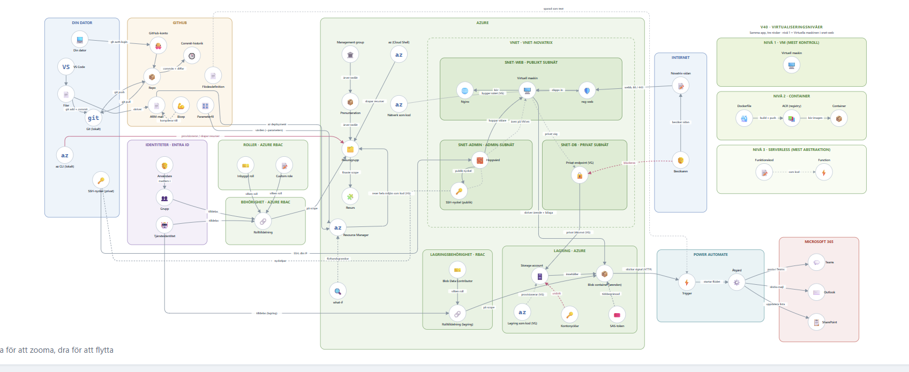

<div align="center">

# ☁️ Azure · Novatrix · MOV25

**Kursrepo för Microsoft Azure**
Adrian Ahlborg — Novatrix AB

### Azure | Ubuntu | Nginx | ARM | Templates | Power Automate
</div>

---

> [!NOTE]
> Samtliga veckor bygger vidare på **samma Azure-miljö**. Varje vecka har en egen mapp med
> genomförande, dokumentation och skärmbilder i ett  sammanfattat dokument.

---

## 🗺️ Översikt

| Vecka | Tema | Nyckelteknik | Status |
|:-----:|------|--------------|:------:|
| [**v34**](v34) | Virtuell maskin och webbserver | Ubuntu VM · Nginx | ✅ |
| [**v35**](v35) | Entra ID och behörigheter | Entra ID · RBAC | ✅ |
| [**v36**](v36) | Nätverk och säkerhet | VNet · Subnät · NSG | ✅ |
| [**v37**](v37/README.md) | Lagring | Storage Account · Blob · Managed Identity | ✅ |
| [**v38**](v38/README.md) | Infrastruktur som kod | ARM-mallar | ✅ |
| [**v39**](v39/README.md) | Automation och integration | Power Automate · Microsoft 365 | ✅ |

---

## 🏗️ Så hänger miljön ihop

<div align="center">

<a href="docs/arkitektur.png">
  
</a>

<sub>Klicka på bilden för att öppna den i full storlek.</sub>

</div>


Kartan visar hela kedjan: från lokal dator och GitHub, via Entra ID, RBAC och det virtuella
nätverket, in i lagringen och vidare ut till Power Automate och Microsoft 365.

---

## 📅 Veckor

<details open>
<summary><b>v34 — Virtuell maskin och webbserver</b></summary>

<br>

- [x] Kursrepo uppsatt med README
- [x] Ubuntu-VM utrullad i Azure
- [x] Nginx installerat och igång
- [x] Kundtjänstsida med ärendeformulär publicerad
- [x] Testat och dokumenterat

➡️ **[Läs dokumentationen för v34](v34)**

</details>

<details>
<summary><b>v35 — Entra ID och behörigheter</b></summary>

<br>

- [x] Veckoavsnitt tillagt i repot
- [x] Användare och grupper uppsatta i Entra ID
- [x] RBAC-roller tilldelade på resursgruppen enligt least privilege
- [x] Managed identity förberedd inför v37
- [x] Behörigheterna verifierade och dokumenterade

➡️ **[Läs dokumentationen för v35](v35)**

</details>

<details>
<summary><b>v36 — Nätverk och säkerhet</b></summary>

<br>

- [x] Veckoavsnitt tillagt i repot
- [x] VNet med publikt och privat subnät
- [x] Trafiken styrd med NSG-regler
- [x] Lösningen flyttad in i nätverket
- [x] Testat och dokumenterat

➡️ **[Läs dokumentationen för v36](v36)**

</details>

<details>
<summary><b>v37 — Lagring</b></summary>

<br>

- [x] Veckoavsnitt tillagt i repot
- [x] Storage account och blob-container skapade
- [x] Ärendeformuläret skriver till lagringen
- [x] Managed identity kopplad med minsta möjliga behörighet
- [x] Testat och dokumenterat

➡️ **[Läs dokumentationen för v37](v37/README.md)**

</details>

<details>
<summary><b>v38 — Infrastruktur som kod</b></summary>

<br>

- [x] Veckoavsnitt tillagt i repot
- [x] ARM-mallar för VM, nätverk och lagring
- [x] Miljön utrullad från mallarna
- [x] Ändring gjord och synlig i historiken
- [x] Dokumenterat hur miljön byggs upp från noll

➡️ **[Läs dokumentationen för v38](v38/README.md)**

</details>

<details>
<summary><b>v39 — Automation och integration</b></summary>

<br>

- [x] Veckoavsnitt tillagt i repot
- [x] Power Automate-flöde som triggas av nytt ärende
- [x] Koppling mot Microsoft 365
- [x] Flödet ihopkopplat med Azure-lösningen
- [x] Hela kedjan testad och dokumenterad

➡️ **[Läs dokumentationen för v39](v39/README.md)**

</details>

---

## 📂 Struktur

```text
Azure-novatrix-mov25/
├── README.md          ← du är här
├── v34/               Virtuell maskin och webbserver
├── v35/               Entra ID och behörigheter
├── v36/               Nätverk och säkerhet
├── v37/               Lagring
├── v38/               Infrastruktur som kod
└── v39/               Automation och integration
```


---

> [!TIP]
> Vill du följa arbetet kronologiskt? Börja i **v34** och läs vidare — varje vecka
> förutsätter miljön som byggdes veckan innan.

<div align="center">

---

**Adrian Ahlborg** · Novatrix AB · MOV25
[⬆️ Till toppen](#️-azure--novatrix--mov25)

</div>
