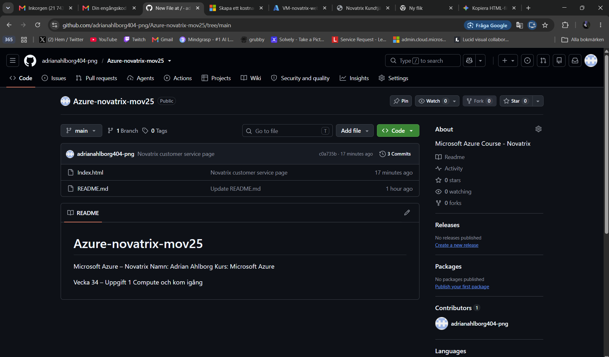
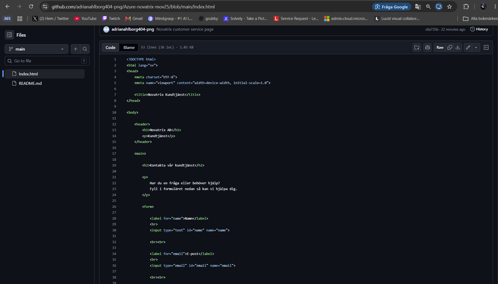
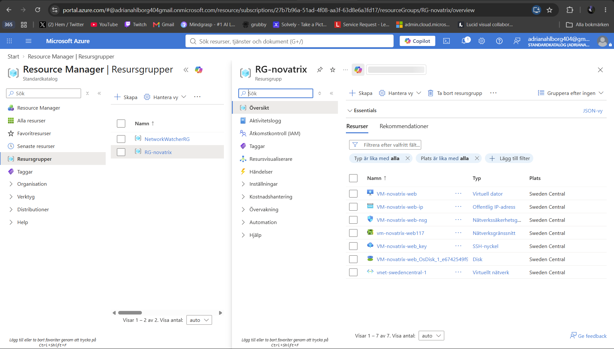
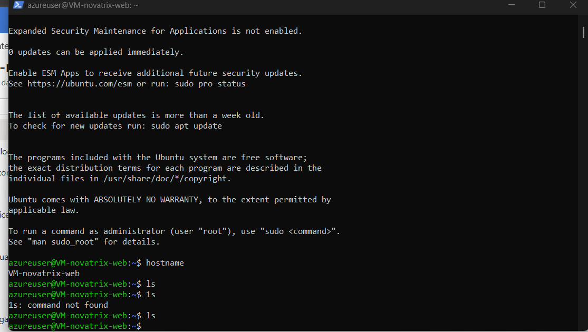
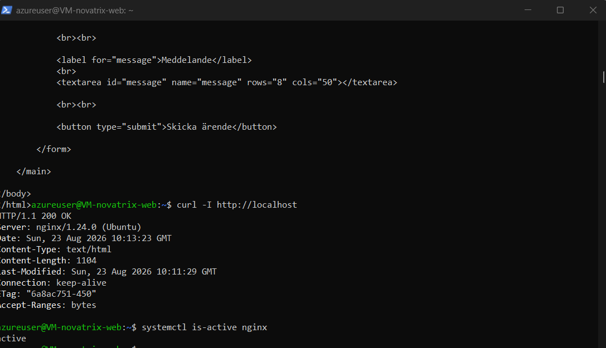
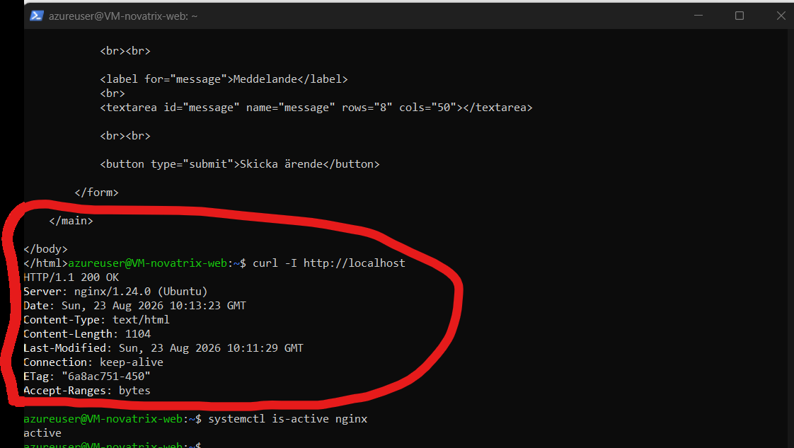
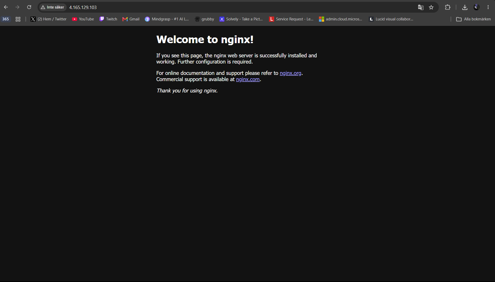
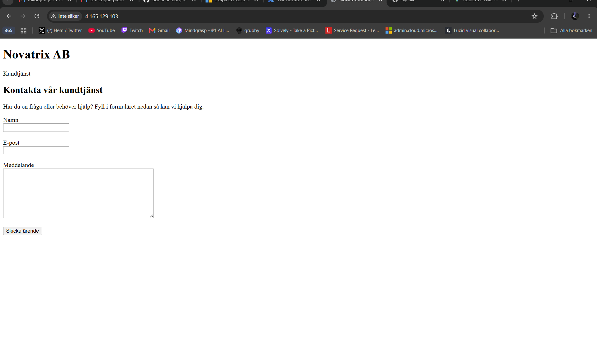

# Uppgift 1: Webbserver i Azure (v34)

En Ubuntu-maskin med Nginx som publicerar Novatrix kundtjänstsida.

**Adrian Forgo Ahlborg** · Microsoft Azure (MOV25), vecka 34 · Novatrix AB · Sweden Central · RG-novatrix

| Resurs | Värde |
|---|---|
| Virtuell maskin | `VM-novatrix-web` (B2ats_v2) |
| Webbserver | Nginx 1.24.0, port 80 |
| Publik IP | `4.165.129.103`, SSH port 22 |

---

## Innehåll

1. [Vad jag har gjort](#1-vad-jag-har-gjort)
2. [Min miljö](#2-min-miljö)
3. [Versionshantering på GitHub](#3-versionshantering-på-github)
4. [Resursgrupp och server](#4-resursgrupp-och-server)
5. [Åtkomst med SSH-nycklar](#5-åtkomst-med-ssh-nycklar)
6. [Nätverk och portar](#6-nätverk-och-portar)
7. [Installation av Nginx](#7-installation-av-nginx)
8. [Kundtjänstsidan](#8-kundtjänstsidan)
9. [Källkod (index.html)](#9-källkod-indexhtml)
10. [Kostnadshantering](#10-kostnadshantering)
11. [Vad jag lärde mig](#11-vad-jag-lärde-mig)

---

## 1. Vad jag har gjort

Jag har byggt Novatrix första server i Azure. En Ubuntu-maskin i en egen resursgrupp, administrerad via SSH-nycklar, med Nginx installerat och företagets kundtjänstsida publicerad på maskinens publika adress. Koden ligger versionshanterad på GitHub.

| Delmoment | Vad jag gjorde | Bevis |
|---|---|---|
| Versionshantering | Publikt repo för kod och dokumentation | Skärmbild 01, 02 |
| Resursgrupp | RG-novatrix samlar alla resurser | Skärmbild 03 |
| Server | Ubuntu-VM i Sweden Central | Skärmbild 03 |
| Åtkomst | SSH med nyckelpar, ingen lösenordsinloggning | Skärmbild 04 |
| Webbserver | Nginx installerat och igång på port 80 | Skärmbild 05–07 |
| Publicering | Kundtjänstsidan ersätter standardsidan | Skärmbild 08 |

## 2. Min miljö

| Objekt | Värde |
|---|---|
| Resursgrupp | `RG-novatrix` |
| Virtuell maskin | `VM-novatrix-web` |
| VM-storlek | `Standard_B2ats_v2` |
| Operativsystem | Ubuntu Server |
| Publik IP | `4.165.129.103` |
| Webbserver | Nginx 1.24.0 (Ubuntu) |
| Region | Sweden Central |

## 3. Versionshantering på GitHub

Ett publikt repository skapades för kursen och används för kod, skript och dokumentation. Att sidans källkod ligger där gör att den går att spåra bakåt och lägga tillbaka om servern måste byggas om.


*Skärmbild 01. Repositoryt Azure-novatrix-mov25 med Index.html och README.md.*


*Skärmbild 02. Källkoden för Index.html versionshanterad i repositoryt.*

## 4. Resursgrupp och server

Alla resurser lades i en egen resursgrupp, **RG-novatrix**. Poängen är att allt som hör till uppgiften går att överblicka på ett ställe — och att radera i ett enda steg när uppgiften är klar. Maskinens storlek och region valdes med hänsyn till kostnad enligt kursens riktlinjer.


*Skärmbild 03. RG-novatrix i Sweden Central: virtuell maskin, publik IP, NSG, nätverksgränssnitt, SSH-nyckel, disk och virtuellt nätverk.*

När en VM skapas i portalen följer flera resurser med automatiskt — nätverkskort, disk, publik adress och en NSG. De hör ihop med maskinen och ligger därför i samma resursgrupp.

## 5. Åtkomst med SSH-nycklar

Servern administreras över SSH från min egen dator. Inloggningen sker med nyckelpar i stället för lösenord, vilket betyder att det inte finns något att gissa sig till.

- Den privata nyckeln ligger lokalt hos mig (`VM-novatrix-web_key.pem`) och lämnar aldrig datorn.
- Den publika nyckeln ligger på servern och används för att verifiera inloggningen.
- Port 22 öppnas i NSG:n för administration och filöverföring med SCP.


*Skärmbild 04. Inloggad som azureuser på VM-novatrix-web; `hostname` bekräftar rätt maskin.*

## 6. Nätverk och portar

Trafiken till servern styrs av en Network Security Group, en brandvägg framför maskinen. Två portar är öppna, och bara två.

| Port | Används till |
|---|---|
| `22 / TCP` | SSH-administration och filöverföring (SCP) |
| `80 / TCP` | HTTP-trafik till kundtjänstsidan |

```text
Webbläsare → Publik IP → NSG (port 80) → Nginx → index.html
```

## 7. Installation av Nginx

Nginx installerades för att ta emot HTTP-förfrågningar på port 80 och servera sidans filer.

```bash
# Uppdatera paketlistan och installera Nginx
sudo apt update
sudo apt install nginx -y

# Verifiera att tjänsten är igång
sudo systemctl status nginx
```


*Skärmbild 05. `systemctl is-active nginx` svarar `active` — tjänsten körs.*


*Skärmbild 06. `curl -I http://localhost` svarar 200 OK från nginx/1.24.0 (Ubuntu).*

Testet på servern själv visar att webbservern svarar. Nästa steg är att visa att den går att nå utifrån, vilket bevisar att port 80 är öppen hela vägen genom NSG:n.


*Skärmbild 07. Nginx standardsida på `http://4.165.129.103` — trafiken tar sig in utifrån.*

## 8. Kundtjänstsidan

Standardsidan byttes mot en enkel HTML-sida för Novatrix AB med ett kontaktformulär för namn, e-post och meddelande.

> **Notera:** formuläret är i den här fasen enbart visuellt. Det skickar och sparar ingen data — backend kommer senare i kursen.


*Skärmbild 08. Kundtjänstsidan publicerad på `http://4.165.129.103`.*

## 9. Källkod (index.html)

```html
<!DOCTYPE html>
<html lang="sv">
<head>
    <meta charset="UTF-8">
    <meta name="viewport" content="width=device-width, initial-scale=1.0">
    <title>Novatrix Kundtjänst</title>
</head>
<body>
    <header>
        <h1>Novatrix AB</h1>
        <p>Kundtjänst</p>
    </header>
    <main>
        <h2>Kontakta vår kundtjänst</h2>
        <p>
            Har du en fråga eller behöver hjälp?
            Fyll i formuläret nedan så kan vi hjälpa dig.
        </p>
        <form>
            <label for="name">Namn</label><br>
            <input type="text" id="name" name="name">
            <br><br>
            <label for="email">E-post</label><br>
            <input type="email" id="email" name="email">
            <br><br>
            <label for="message">Meddelande</label><br>
            <textarea id="message" name="message" rows="8" cols="50"></textarea>
            <br><br>
            <button type="submit">Skicka ärende</button>
        </form>
    </main>
</body>
</html>
```

## 10. Kostnadshantering

En VM kostar pengar varje timme den är igång, även när ingen använder den. Därför sattes gränserna upp innan maskinen började användas på riktigt.

| Åtgärd | Varför |
|---|---|
| B2ats_v2 | Låg timkostnad, tillräckligt för en webbserver med en statisk sida |
| Sweden Central | Närmaste region, låg latens och rimligt pris |
| Budgetlarm | Varning vid 50 % och 90 % av budgeten |
| Anomaly alerts | Fångar oväntade kostnadstoppar innan de hinner växa |
| Deallokering | Maskinen stängs av när den inte används |
| Uppstädning | Hela RG-novatrix raderas när uppgiften är avslutad |

## 11. Vad jag lärde mig

**Att en webbserver som svarar lokalt inte betyder att den är nåbar.**
`curl` mot localhost visar bara att Nginx lever — först när sidan laddas i webbläsaren över den publika adressen vet jag att NSG:n släpper igenom trafiken.

**Att nycklar är enklare än lösenord, inte krångligare.**
När nyckelparet väl finns är inloggningen ett kommando, och det finns inget lösenord som kan gissas eller läcka.

**Att kostnadskontroll hör till uppsättningen.**
Budgetlarm och avstängning av maskinen kostar inget att sätta upp i förväg, men är svåra att ta igen i efterhand.
