# Uppgift 2: Identitet och behörigheter (v35)

Användare, grupper och RBAC-roller i Entra ID för Novatrix miljö i Azure.

**Adrian Forgo Ahlborg** · Microsoft Azure (MOV25), vecka 35 · Novatrix AB

---

## Innehåll

1. [Sammanfattning av genomförandet](#1-sammanfattning-av-genomförandet)
2. [Miljöspecifikation](#2-miljöspecifikation)
3. [Identitetsstruktur i Entra ID](#3-identitetsstruktur-i-entra-id)
4. [Analys av rolltilldelning (RBAC)](#4-analys-av-rolltilldelning-rbac)
5. [Behörighetsarv och omfattning](#5-behörighetsarv-och-omfattning)
6. [Hanterad identitet för applikationen](#6-hanterad-identitet-för-applikationen)
7. [Verifiering och testresultat](#7-verifiering-och-testresultat)
8. [Lärdomar och reflektioner](#8-lärdomar-och-reflektioner)

---

## 1. Sammanfattning av genomförandet

Jag har konfigurerat användare, grupper och behörigheter för Novatrix miljö i Azure. Fokus har legat på principen om least privilege, vilket innebär att användare tilldelas exakt de rättigheter som krävs för deras arbetsuppgifter, och inget mer.

| Moment | Genomförande | Referens |
|---|---|---|
| Identiteter | 2 grupper och 2 användare i Entra ID | Skärmbild 01–05 |
| Behörigheter | 3 RBAC-roller på resursgruppsnivå | Skärmbild 06 |
| App-identitet | Skapat ID-Novatrix-App (Managed Identity) | Skärmbild 07–08 |
| Verifiering | Genomfört tester av behörighetsbegränsningar | Skärmbild 09–12 |

## 2. Miljöspecifikation

Dokumentationen bygger vidare på infrastrukturen från föregående uppgift.

| Objekt | Värde |
|---|---|
| Prenumeration | Azure 01 |
| Resursgrupp | `RG-novatrix` |
| Virtuell maskin | `VM-novatrix-web` |
| Region | Sweden Central |
| Entra-domän | `adrianahlborg404gmail.onmicrosoft.com` |

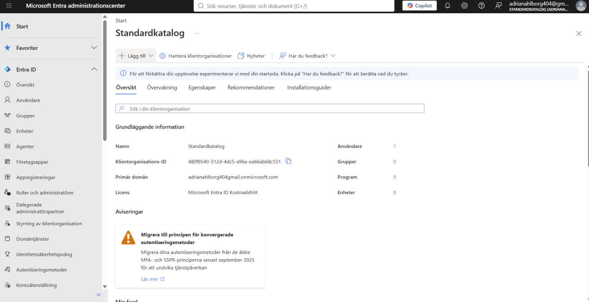
*Skärmbild 01. Översikt över Entra-katalogen (Standardkatalog) med klientorganisations-ID och primär domän.*

## 3. Identitetsstruktur i Entra ID

Jag har skapat två grupper för att separera ansvarsområden enligt kraven. Genom att tilldela roller till grupper istället för individer förenklas administrationen av nyanställda och avslutade tjänster.

| Grupp | Användare | Ansvarsområde |
|---|---|---|
| Novatrix-Drift | Anna Drift | Drift och serverunderhåll |
| Novatrix-Utveckling | Erik Dev | Applikationsutveckling |

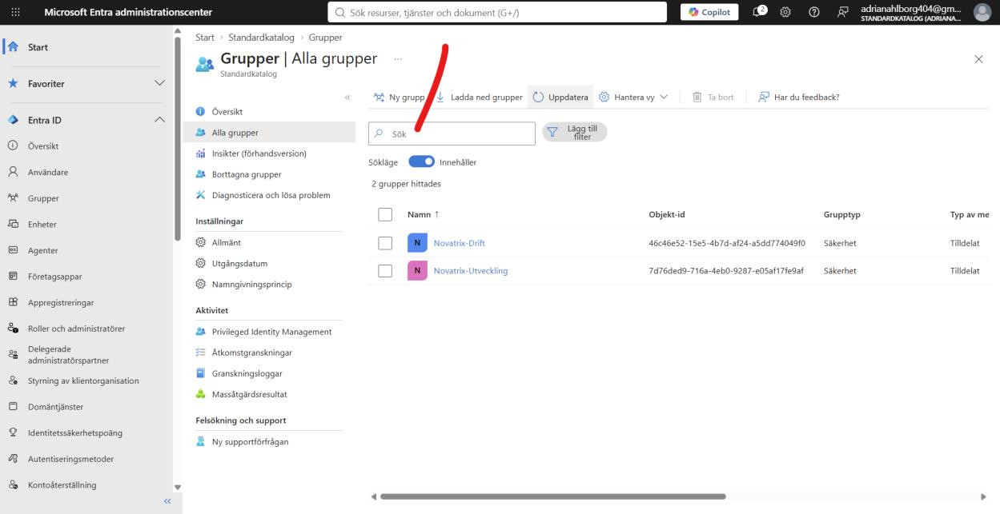
*Skärmbild 02. Säkerhetsgrupperna Novatrix-Drift och Novatrix-Utveckling i Entra ID.*

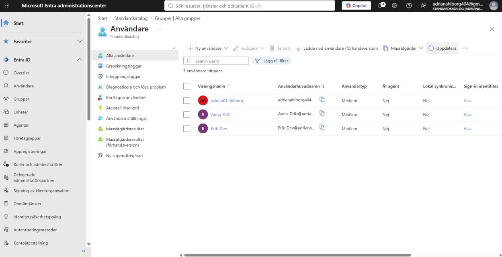
*Skärmbild 03. Användarna Anna-Drift och Erik-Dev skapade i katalogen.*

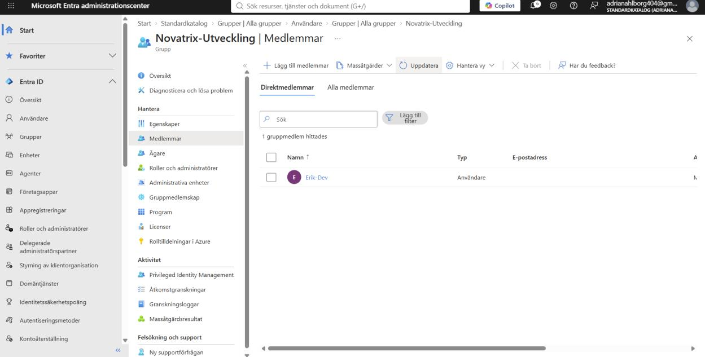
*Skärmbild 04. Medlemskap: Erik-Dev är direktmedlem i Novatrix-Utveckling.*

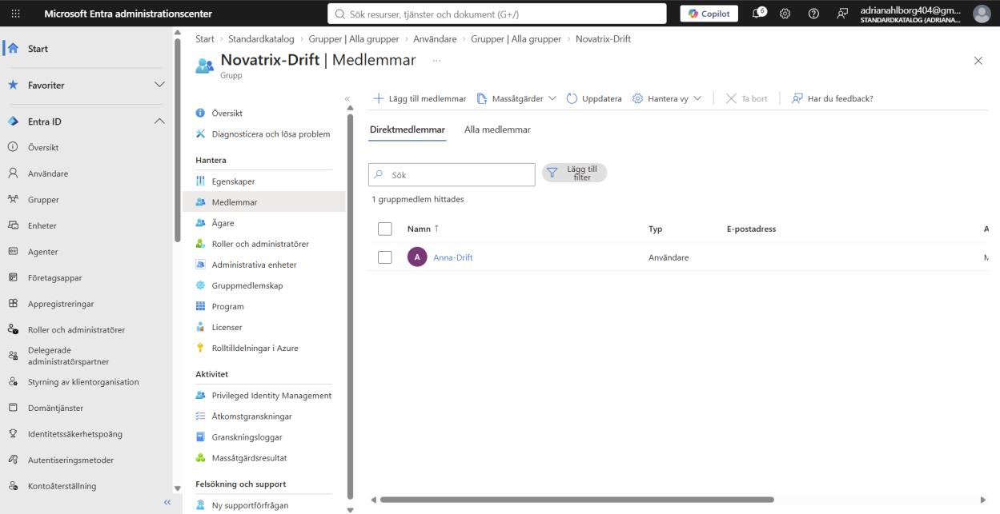
*Skärmbild 05. Medlemskap: Anna-Drift är direktmedlem i Novatrix-Drift.*

## 4. Analys av rolltilldelning (RBAC)

Rollerna har valts utifrån principen om minsta behörighet för att säkra miljön.

### Driftteam (Anna Drift)

Anna har tilldelats rollerna Virtual Machine Contributor och Network Contributor på resursgruppen `RG-novatrix`.

- **Motivering:** Hon behöver kunna hantera den virtuella maskinen (start/stopp/skalning) samt konfigurera nätverksregler (NSG). Eftersom NSG är en separat resurs krävs rollen Network Contributor utöver VM-rollen.
- **Bortvalda roller:** Rollen Owner valdes bort då den tillåter ändring av behörigheter, vilket är en administrativ uppgift. Contributor valdes bort då den ger rättighet att skapa helt nya resurstyper som Anna inte behöver för sitt driftarbete.

### Utvecklingsteam (Erik Dev)

Erik har tilldelats rollen Reader på resursgruppen `RG-novatrix`.

- **Motivering:** Erik behöver se IP-adresser och inställningar för felsökning, men ska inte kunna ändra konfigurationen. Reader-rollen begränsar honom till att endast läsa metadata, inte faktiskt innehåll i framtida lagringstjänster.

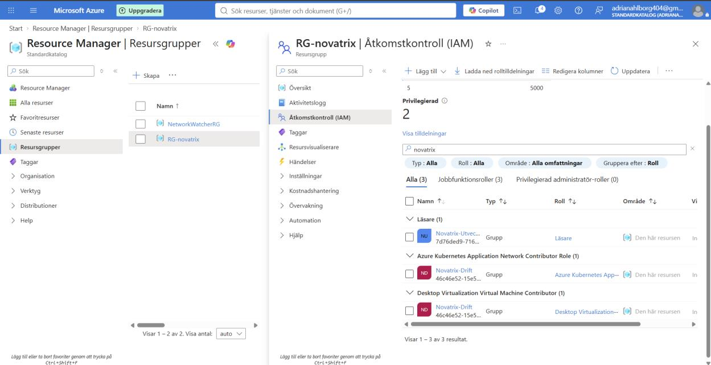
*Skärmbild 06. Rolltilldelningar på RG-novatrix: Läsare till Novatrix-Utveckling samt två Contributor-roller till Novatrix-Drift.*

## 5. Behörighetsarv och omfattning

Alla behörigheter har tilldelats på resursgruppens nivå. Detta säkerställer att:

1. Resurser inom gruppen ärver behörigheten automatiskt.
2. Användarna inte får åtkomst till andra framtida projekt eller resurser i samma prenumeration som inte tillhör Novatrix.

## 6. Hanterad identitet för applikationen

Jag har skapat en User-assigned Managed Identity vid namn `ID-Novatrix-App`.

- **Syfte:** Möjliggöra säker kommunikation mellan applikationen och Azure-tjänster (t.ex. Storage) utan att använda lösenord eller hemligheter i källkoden.
- **Implementering:** Identiteten har för närvarande inga rättigheter, men kommer att konfigureras i kommande moment för lagringshantering.

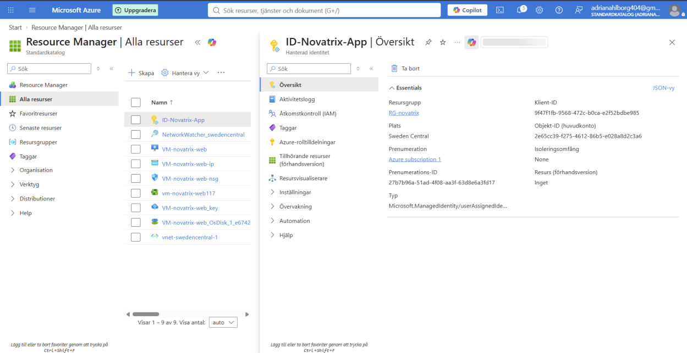
*Skärmbild 07. Den hanterade identiteten ID-Novatrix-App med klient-ID och objekt-ID.*

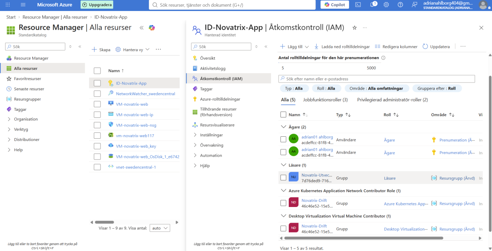
*Skärmbild 08. Åtkomstkontroll (IAM) för ID-Novatrix-App. Identiteten har inga egna rolltilldelningar, endast ärvda tilldelningar visas.*

## 7. Verifiering och testresultat

Verifiering har genomförts genom att logga in som respektive användare för att bekräfta både vad de kan göra och var deras behörighet tar slut.

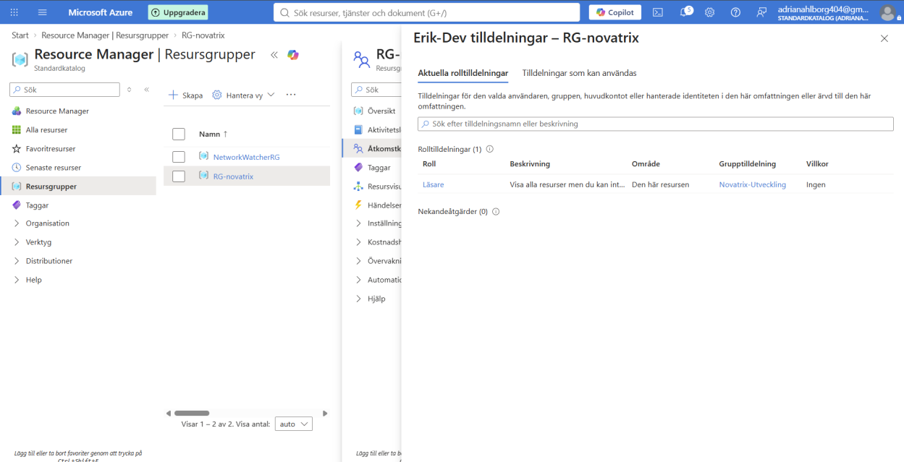
*Skärmbild 09. Check access: Erik-Dev har rollen Läsare på RG-novatrix via grupptilldelningen Novatrix-Utveckling.*

### Testresultat – Erik (Reader)

| Test | Resultat | Kommentar |
|---|---|---|
| Visa översikt | Godkänt | Erik kan se status på VM:en |
| Starta om VM | Nekat | Knappar för kontroll är inaktiverade |
| Ändra nätverk | Nekat | Systemet ger felmeddelande vid försök till ändring |

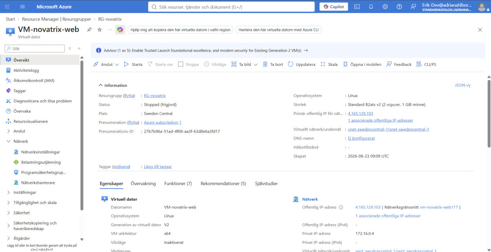
*Skärmbild 10. Erik inloggad: översikten för VM-novatrix-web är läsbar, men åtgärdsknapparna är inaktiverade.*

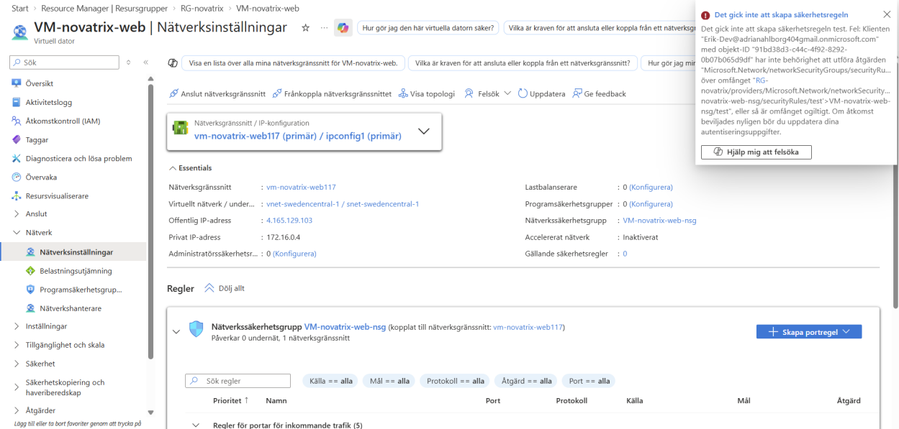
*Skärmbild 11. Erik nekas när han försöker skapa en säkerhetsregel i NSG:n, behörighet saknas för åtgärden.*

### Testresultat – Anna (Drift)

| Test | Resultat | Kommentar |
|---|---|---|
| Starta om VM | Godkänt | Full kontroll över driftläget |
| Hantera IAM | Nekat | Anna kan inte tilldela roller till sig själv eller andra, vilket bekräftar att hon inte är Owner |

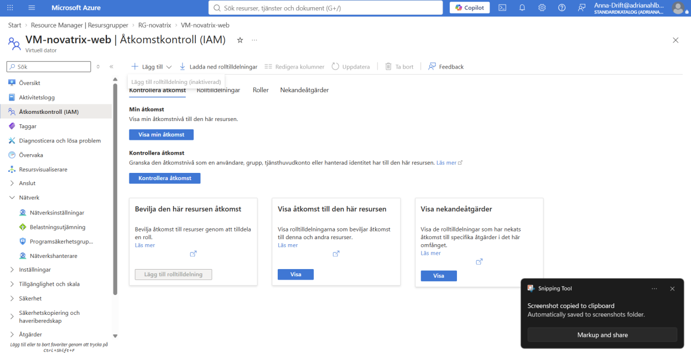
*Skärmbild 12. Anna inloggad: knappen Lägg till rolltilldelning är inaktiverad i Åtkomstkontroll (IAM).*

## 8. Lärdomar och reflektioner

Arbetet har tydliggjort vikten av var i hierarkin en roll tilldelas. Samma roll kan ge extremt olika omfattning beroende på om den sätts på prenumerations- eller resursgruppsnivå. Separation mellan Entra ID (identiteter) och Azure RBAC (resursåtkomst) är också en central insikt för säker molnhantering.
