# Nätverk och säkerhet

**Microsoft Azure · Uppgift 3 av 8 · Vecka 36**

Ett segmenterat virtuellt nätverk för Novatrix kundtjänst.

| Resurs | Namn | Adressintervall |
|---|---|---|
| Virtuellt nätverk | `Vnet-Novatrix` | `10.20.0.0/16` |
| Publikt subnät | `snet-public` | `10.20.1.0/24` |
| Privat subnät | `snet-private` | `10.20.2.0/24` |

Adrian Forgo Ahlborg · Novatrix AB · Sweden Central · RG-novatrix

---

## Innehåll

1. [Vad jag har gjort](#1-vad-jag-har-gjort)
2. [Min miljö](#2-min-miljö)
3. [Nätverksdesign](#3-nätverksdesign)
4. [Brandväggsreglerna och varför de ser ut så](#4-brandväggsreglerna-och-varför-de-ser-ut-så)
5. [Att koppla reglerna till subnäten](#5-att-koppla-reglerna-till-subnäten)
6. [Var servern hamnade](#6-var-servern-hamnade)
7. [Defense in depth – flera lager](#7-defense-in-depth--flera-lager)
8. [Att jag testade att det funkar](#8-att-jag-testade-att-det-funkar)
9. [Vad jag lärde mig](#9-vad-jag-lärde-mig)

---

## 1. Vad jag har gjort

Jag har byggt ett eget virtuellt nätverk runt Novatrix kundtjänst och delat upp det i en publik och en privat del. Webbservern med ärendeformuläret ligger i den publika delen, och den privata delen står tom och redo för lagringen som kommer i v37. Trafiken styrs av brandväggsregler som bara släpper igenom det som behövs.

| Delmoment | Vad jag gjorde | Bevis |
|---|---|---|
| Nätverk | Vnet-Novatrix med två subnät | Skärmbild 01 |
| Brandväggar | Två NSG:er, en per subnät | Skärmbild 02, 03 |
| Koppling | NSG:erna kopplade till varsitt subnät | Skärmbild 04, 05 |
| Placering | Servern byggd direkt i snet-public | Skärmbild 06 |
| Extra lager | Brandvägg på själva servern | Skärmbild 07 |
| Verifiering | Testat vad som släpps igenom och vad som stoppas | Skärmbild 08–13 |

## 2. Min miljö

| Objekt | Värde |
|---|---|
| Resursgrupp | `RG-novatrix` |
| Virtuellt nätverk | `Vnet-Novatrix` (`10.20.0.0/16`) |
| Publikt subnät | `snet-public` (`10.20.1.0/24`) |
| Privat subnät | `snet-private` (`10.20.2.0/24`) |
| Virtuell maskin | `VM-Novatrix-Web-02-vecka-36-ny` |
| Publik IP | `74.241.168.58` |
| Privat IP | `10.20.1.4` |
| Region | Sweden Central |

## 3. Nätverksdesign

```
                  Internet
                     │
  port 80/443        │        port 22 (bara min IP)
                     ▼
┌───────────────────────────────────────┐
│  Vnet-Novatrix  10.20.0.0/16          │
│                                       │
│  ┌─────────────────────────────────┐  │
│  │ snet-public  10.20.1.0/24       │  │
│  │ [nsg-public]                    │  │
│  │                                 │  │
│  │ VM-Novatrix-Web-02              │  │
│  │ 10.20.1.4                       │  │
│  │ Nginx + kundtjänstsidan         │  │
│  │ + brandvägg på servern (ufw)    │  │
│  └────────────┬────────────────────┘  │
│               │ port 443              │
│               ▼                       │
│  ┌─────────────────────────────────┐  │
│  │ snet-private  10.20.2.0/24      │  │
│  │ [NSG-private]                   │  │
│  │                                 │  │
│  │ Tomt — lagringen kommer v37     │  │
│  │ Inget släpps in från internet   │  │
│  └─────────────────────────────────┘  │
└───────────────────────────────────────┘
```

Uppdelningen bygger på en enda fråga: behöver den här saken nås från internet? Formuläret måste besökare komma åt, alltså ligger det publikt. Lagringen ska ingen utomstående komma åt, alltså ligger den privat. Gränsen mellan subnäten är det som gör skillnaden möjlig att upprätthålla med regler.

Jag valde `10.20.0.0/16` som adressutrymme och gav varje subnät ett eget `/24`. Det räcker med god marginal och lämnar plats för fler subnät längre fram.

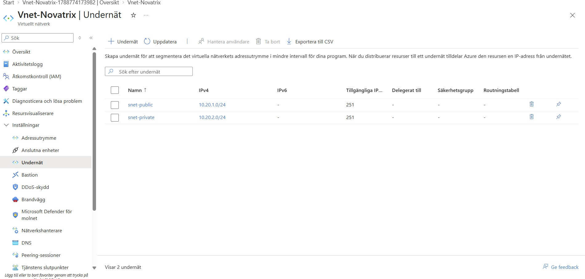
*Skärmbild 01. Undernäten snet-public och snet-private i Vnet-Novatrix.*

## 4. Brandväggsreglerna och varför de ser ut så

### nsg-public

| Prioritet | Namn | Släpper in | Varför |
|---|---|---|---|
| 100 | Allow-HTTP | port 80 från internet | Besökare måste nå formuläret |
| 110 | Allow-HTTPS | port 443 från internet | Förberett för certifikat |
| 120 | Allow-SSH-Admin | port 22, bara `31.208.x.x/32` | Jag behöver kunna administrera servern |
| 65500 | DenyAllInBound | inget | Azures inbyggda sistaregel |

Regel 120 är den viktigaste. Standard när man skapar en VM i Azure är att SSH öppnas mot hela internet, och då kan vem som helst i världen sitta och gissa sig in. Genom att sätta källan till min egen adress är porten stängd för alla andra.

Jag behövde ingen egen regel som stänger resten. Azure har en inbyggd sistaregel som nekar allt ingen tidigare regel har tillåtit. Regler läses uppifrån och ner, och den första som matchar avgör.

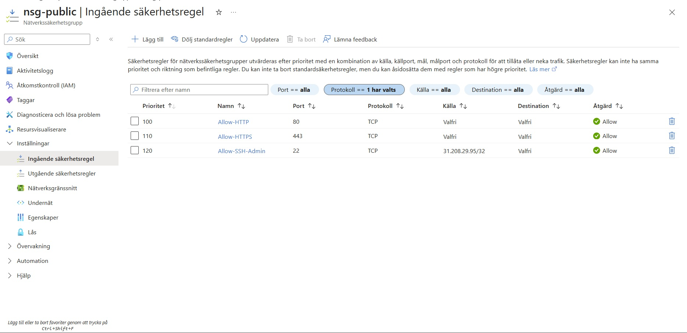
*Skärmbild 02. Inkommande regler i nsg-public.*

### NSG-private

| Prioritet | Namn | Släpper in | Varför |
|---|---|---|---|
| 100 | Allow-from-public-subnet | port 443 från `10.20.1.0/24` | Webbservern ska nå lagringen i v37 |
| 4000 | Deny-internet-inbound | inget från internet | Gör avsikten tydlig i regellistan |
| 65500 | DenyAllInBound | inget | Azures inbyggda sistaregel |

Regel 100 släpper in trafik från det publika subnätet på den port som behövs, och ingenting utifrån internet kommer in. En sak ska dock sägas rakt ut: Azures standardregel `AllowVnetInBound` på 65000 släpper igenom all trafik inom det virtuella nätverket, på alla portar. Regel 100 är alltså mer en tydlig markering av vilken trafik som är tänkt än den enda vägen in. Eftersom `snet-public` är det enda andra subnätet i nätverket blir skillnaden liten i dag, men vill jag strama åt det kan jag lägga till en neka-regel för `VirtualNetwork` på en prioritet efter regel 100, till exempel 4010.

Utgående trafik lämnade jag öppen. Servern behöver hämta uppdateringar med `apt` och ska prata med Azure Storage i v37. Att strypa utgående trafik är möjligt men kräver att man först kartlägger allt servern behöver nå.

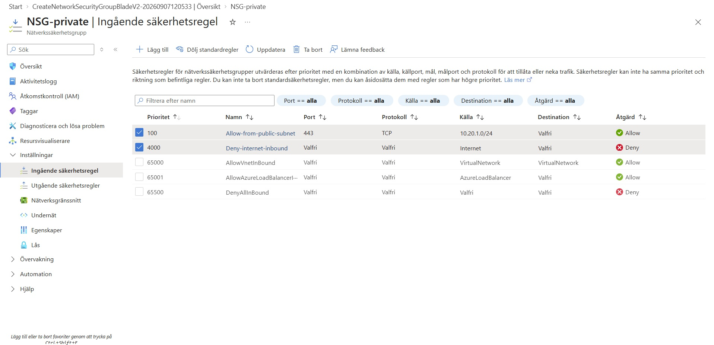
*Skärmbild 03. Inkommande regler i NSG-private, med Azures standardregler synliga.*

## 5. Att koppla reglerna till subnäten

En NSG gör ingenting förrän den kopplas till något. Innan kopplingen är den bara en lista. Jag kopplade `nsg-public` till `snet-public` och `NSG-private` till `snet-private`.

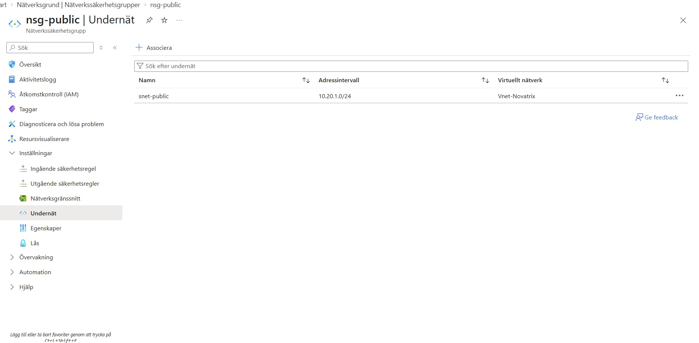
*Skärmbild 04. nsg-public kopplad till undernätet snet-public.*

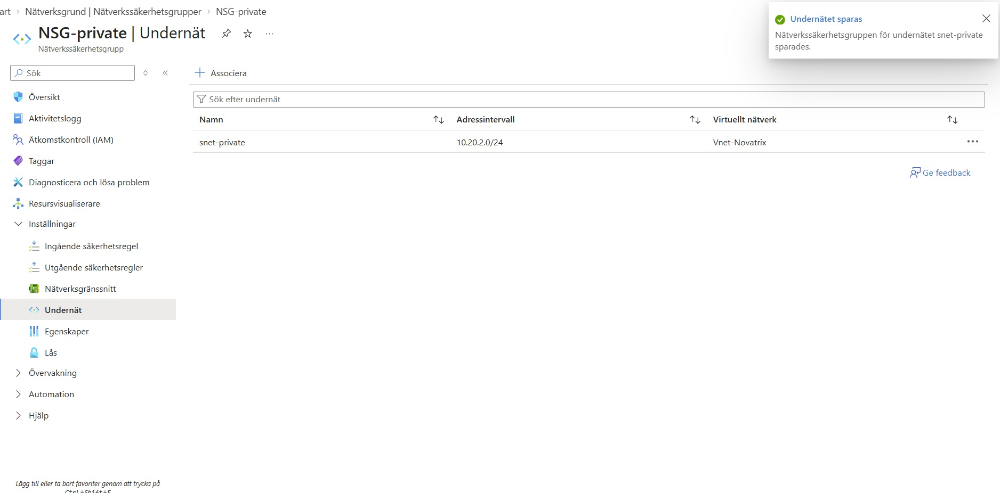
*Skärmbild 05. NSG-private kopplad till undernätet snet-private.*

## 6. Var servern hamnade

Eftersom en virtuell maskin inte går att flytta mellan virtuella nätverk byggde jag nätverket först och servern sist. Då hamnade den rätt direkt.

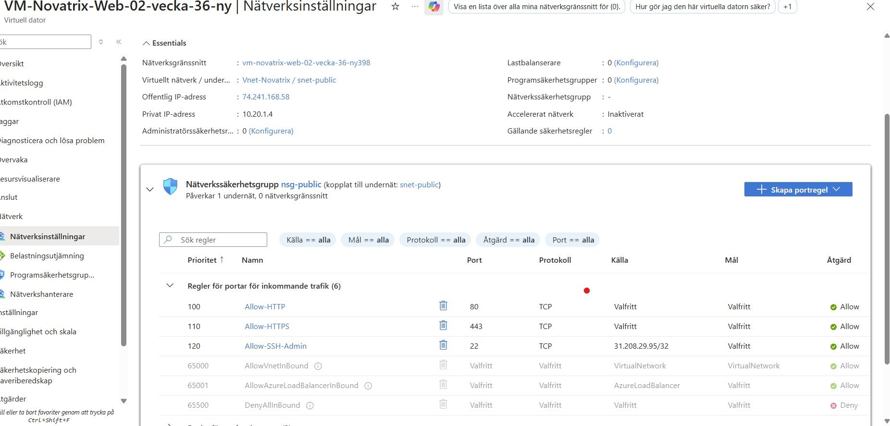
*Skärmbild 06. Serverns nätverksinställningar med subnät, privat adress och kopplad NSG.*

Bilden visar tre saker jag ville kunna bevisa:

- Servern ligger i `Vnet-Novatrix / snet-public`, och dess privata adress `10.20.1.4` ligger inom det publika subnätets intervall.
- Fältet **Nätverkssäkerhetsgrupp** på nätverkskortet står tomt, alltså finns ingen extra brandvägg där. Det var ett medvetet val — hade nätverkskortet haft en egen NSG skulle två uppsättningar regler behöva släppa igenom samma trafik, och det blir svårt att felsöka när något blockeras.
- Rutan under visar att `nsg-public` är kopplad via undernätet och påverkar 1 undernät och 0 nätverksgränssnitt. Ett enda lager på nätverkssidan, tydligt och lätt att följa.

## 7. Defense in depth – flera lager

Poängen är att ingen enskild inställning ska vara det enda som står mellan en angripare och lösningen. Om ett lager fallerar finns nästa kvar.

| Lager | Vad det gör |
|---|---|
| Nätverksdelning | Publikt och privat subnät är åtskilda |
| NSG på publikt subnät | Bara port 80, 443 och SSH från min adress |
| NSG på privat subnät | Ingenting från internet, bara trafik inifrån det virtuella nätverket |
| Brandvägg på servern | `ufw` stoppar allt utom port 22 och 80 |
| SSH-nycklar | Ingen lösenordsinloggning, alltså inget att gissa |
| RBAC från v35 | Även den som får åtkomst kan bara göra det rollen tillåter |
| Hanterad identitet | Inga lösenord i koden att stjäla |

De tre nedersta byggde jag inte den här veckan, men de hör till samma försvar. Nätverket är ett lager, inte hela skyddet.

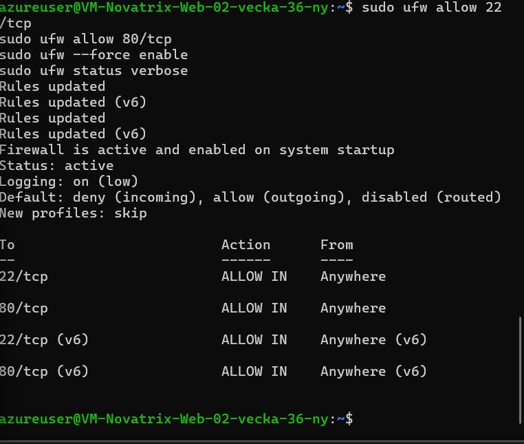
*Skärmbild 07. Utdata från `ufw status verbose` på servern.*

Raden `Default: deny (incoming), allow (outgoing)` är kärnan. Servern nekar allt inkommande som standard, och bara port 22 och 80 är uttryckligen öppnade. Även om en NSG-regel skulle råka bli för bred stoppar det här lagret trafiken.

## 8. Att jag testade att det funkar

Att visa att något fungerar är enkelt. Det som bevisar att skyddet sitter är att visa var trafiken **stoppas**.

| Test | Förväntat | Resultat | Bevis |
|---|---|---|---|
| Öppna sidan i webbläsaren | Ska funka | Sidan laddades | Skärmbild 08 |
| SSH från min dator | Ska funka | Jag kom in | Skärmbild 09 |
| Ansluta till port 8080 | Ska nekas | Timeout, inget svar | Skärmbild 10 |
| Port 80 från internet, testat i Azure | Tillåten | Allow-HTTP | Skärmbild 11 |
| Port 22 från annan IP, testat i Azure | Nekad | DenyAllInBound | Skärmbild 12 |

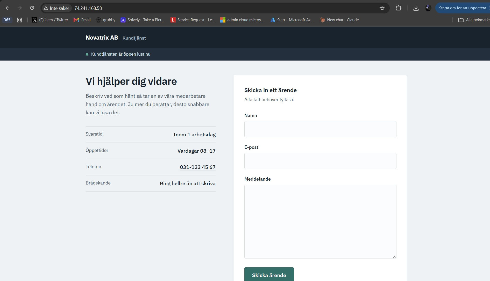
*Skärmbild 08. Kundtjänstsidan svarar på 74.241.168.58.*

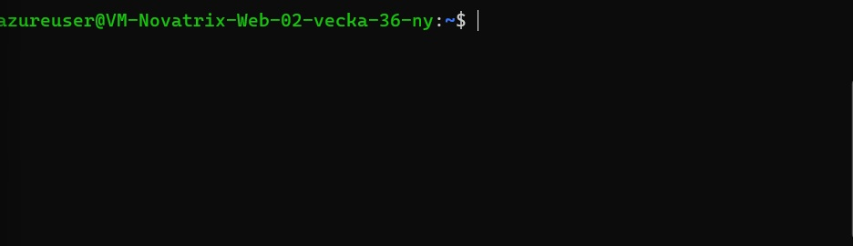
*Skärmbild 09. Inloggad på servern via SSH.*

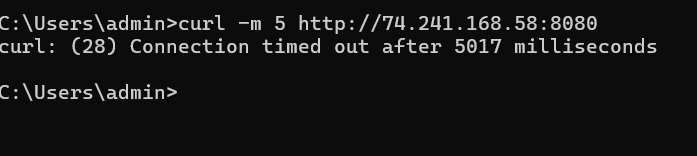
*Skärmbild 10. curl mot port 8080 får inget svar och tar slut på tid.*

Port 8080 är aldrig öppnad i någon regel. Anslutningen får inget svar alls och tar slut på tid efter fem sekunder. Att det blir tyst snarare än ett avvisande är typiskt för en brandvägg som släpper paketen utan att svara.

### Verifiering med Azures eget verktyg

De två sista testen gjorde jag med **Verifiera IP-flöde** i Network Watcher. Det är starkare bevis än att bara visa att sidan laddar, eftersom Azure själv svarar på om trafiken hade släppts igenom, och talar om vilken regel som avgjorde det.

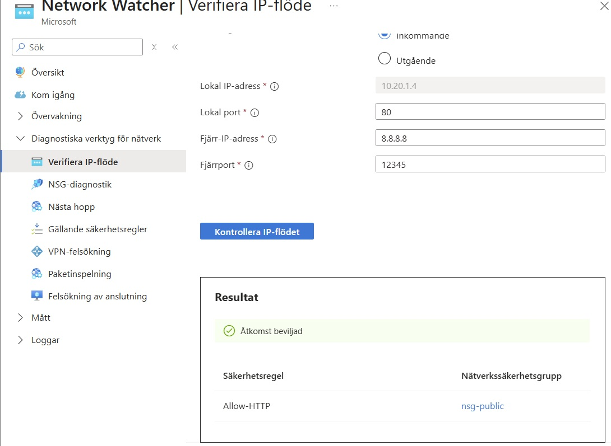
*Skärmbild 11. IP-flödesverifiering för port 80 ger Åtkomst beviljad.*

Azure svarar **Åtkomst beviljad** och pekar ut regeln `Allow-HTTP` i `nsg-public`.

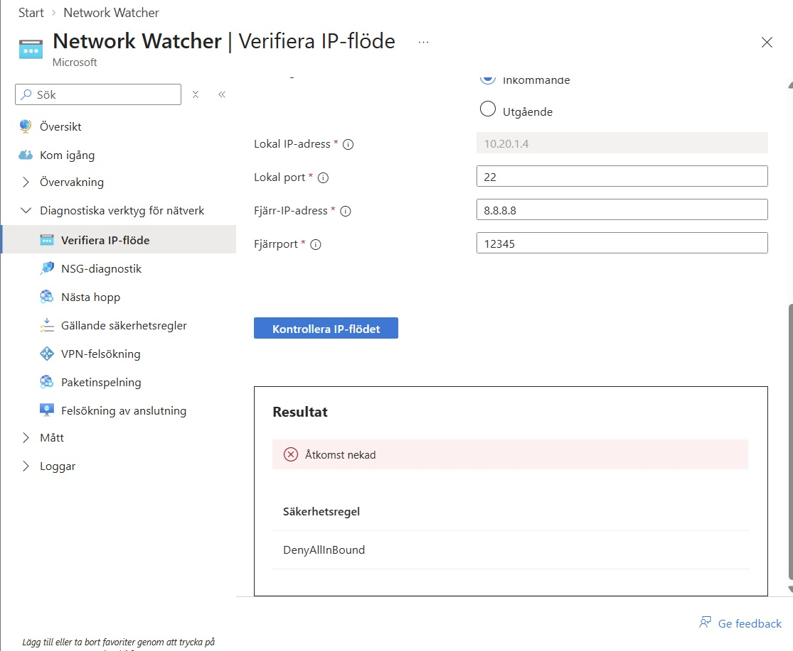
*Skärmbild 12. IP-flödesverifiering för port 22 ger Åtkomst nekad.*

Här är svaret **Åtkomst nekad**, och regeln som stoppade trafiken heter `DenyAllInBound`. Det är värt att förstå varför det inte blev `Allow-SSH-Admin` som svarade: testet gjordes från `8.8.8.8`, som inte är min adress. Regel 120 matchade därför inte, och trafiken föll vidare ner genom regellistan tills Azures inbyggda sistaregel fångade den.

Det är precis det beteendet jag ville bevisa. Port 22 är öppen för mig och stängd för alla andra, och det är regellistans ordning som avgör det.

### Gällande regler på servern

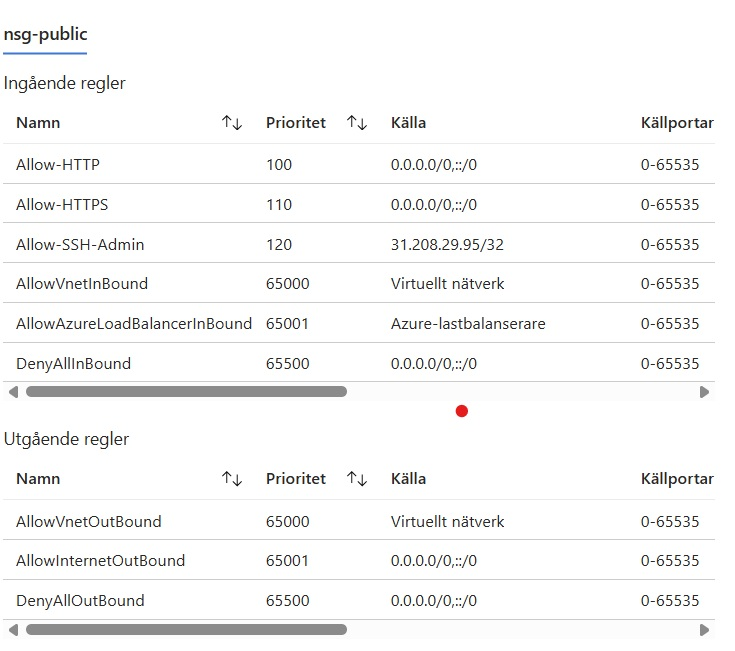
*Skärmbild 13. Samtliga säkerhetsregler som gäller för nätverkskortet.*

Här syns skillnaden i källkolumnen tydligt. `Allow-HTTP` och `Allow-HTTPS` har `0.0.0.0/0`, alltså hela internet — vem som helst får nå formuläret. `Allow-SSH-Admin` har en enda adress. Det är least privilege i praktiken.

Två av standardreglerna är värda att nämna. `DenyAllInBound` på 65500 är den som stänger allt jag inte öppnat, och därför behövde jag ingen egen blockeringsregel. `AllowVnetInBound` på 65000 släpper igenom trafik inom det virtuella nätverket. Den är bredare än min egen regel för det privata subnätet och släpper in på alla portar, vilket jag tar upp under NSG-private i avsnitt 4.

## 9. Vad jag lärde mig

**Att en brandväggsregel inte gör någon nytta förrän den kopplas till ett subnät.**
Jag skapade NSG:erna först och kopplade dem i ett eget steg, och innan kopplingen fanns var reglerna bara en lista utan verkan.

**Att en virtuell maskin inte går att flytta mellan nätverk.**
Min gamla server låg i nätverket Azure skapade automatiskt i v34, och eftersom nätverkskortet är låst till sitt nätverk fick jag bygga en ny server i det nya subnätet. Det var därför jag byggde nätverket först och servern sist.

**Att en nekad anslutning kan stoppas av en annan regel än man tror.**
Att `DenyAllInBound` fångade SSH-testet istället för min egen regel gjorde att jag förstod hur regellistan faktiskt läses — uppifrån och ner, tills något matchar.

**Att RBAC-rollerna från v35 följde med utan att jag rörde dem.**
Eftersom de ligger på resursgruppen och inte på den enskilda maskinen gäller de den nya servern också. Det var första gången jag såg nyttan av att ha valt rätt nivå.
