# v38 – Infrastructure as Code med ARM-templates

**Kurs:** Microsoft Azure (MOV25) · **Vecka:** 38 · **Uppgift:** 5 av 8 · **Företag:** Novatrix AB
**Repo:** <https://github.com/adrianahlborg404-png/Azure-novatrix-mov25>

I tidigare veckor har Novatrix kundtjänst byggts upp steg för steg i Azure-portalen. Den här veckan beskrivs en del av miljön som kod. En ARM-template provisionerar lagringen för ärendeformuläret och nätverket runt det. Mallen är versionshanterad i GitHub och kan köras om när som helst, med samma resultat varje gång.

---

## Innehåll

1. [Översikt](#översikt)
2. [Delmoment 1 – Repo](#delmoment-1--repo)
3. [Delmoment 2 – Template](#delmoment-2--template)
4. [Delmoment 3 – Deploy och verifiering](#delmoment-3--deploy-och-verifiering)
5. [Delmoment 4 – Versionshantering](#delmoment-4--versionshantering)
6. [Delmoment 5 – Återskapa miljön](#delmoment-5--återskapa-miljön)
7. [Begränsningar och reflektion](#begränsningar-och-reflektion)

---

## Översikt

| Del av miljön | Hur den byggs | Var |
|---|---|---|
| Storage account + container `arenden` | **ARM-template** | `rg-novatrix-iac` |
| NSG med webbregel (80/443) | **ARM-template** | `rg-novatrix-iac` |
| VNet `10.20.0.0/16` med `snet-public` och `snet-private` | **ARM-template** | `rg-novatrix-iac` |
| VM med Nginx och ärendeformulär | Manuellt (v34/v37) | `RG-novatrix` |
| Entra ID-användare, grupper och RBAC | Manuellt (v35) | Entra ID |

Mallen deployas till en **egen, tom resursgrupp** (`rg-novatrix-iac`) och inte till den handbyggda `RG-novatrix`. Då krockar den inte med befintliga resurser. Att allt skapas i en tom grupp visar dessutom att mallen är komplett och inte beror på något som klickats fram i portalen.

---

## Delmoment 1 – Repo

Mallen och skriptet ligger versionshanterade i kursrepot, i mappen `v38/`:

```
v38/
├── README.md                          ← den här dokumentationen
├── GUIDE.md                           ← steg-för-steg-guide
├── deploy.sh                          ← what-if + deploy i ett kommando
├── bilder/                            ← skärmbilder
└── templates/
    ├── azuredeploy.json               ← ARM-mallen
    └── azuredeploy.parameters.json    ← parametervärden (inga hemligheter)
```

| Fil | Syfte |
|---|---|
| `templates/azuredeploy.json` | Beskriver *vad* som ska finnas i Azure: storage, container, NSG och VNet. |
| `templates/azuredeploy.parameters.json` | Värden för just den här miljön, så att mallen kan återanvändas med andra värden. |
| `deploy.sh` | Skapar resursgruppen, visar en förhandsgranskning (what-if) och deployar efter bekräftelse. |


---

## Delmoment 2 – Template

### Resurser

| Resurs | Namn | Viktiga inställningar |
|---|---|---|
| Storage account | `stnovatrix` + unikt suffix | StorageV2, TLS 1.2, endast HTTPS, publik blob-åtkomst avstängd |
| Blob service | `default` | – |
| Container | `arenden` | `publicAccess: None` (privat) |
| NSG | `nsg-novatrix-public` | `Allow-Web-Inbound`: TCP 80 och 443 från Internet |
| VNet | `vnet-novatrix` | `10.20.0.0/16`, `snet-public` (`10.20.1.0/24`, med NSG) och `snet-private` (`10.20.2.0/24`) |

### Parametrar – det som varierar mellan miljöer

| Parameter | Standardvärde | Varför parameter |
|---|---|---|
| `namePrefix` | `novatrix` | Samma mall kan skapa t.ex. en test- och en produktionsmiljö med olika namn |
| `location` | resursgruppens region | Region väljs vid deploy, inte i koden |
| `storageSku` | `Standard_LRS` | Redundans kan höjas (`Standard_GRS`); `allowedValues` stoppar felstavningar |
| `vnetAddressPrefix` | `10.20.0.0/16` | Adressplan kan skilja mellan miljöer |
| `publicSubnetPrefix` | `10.20.1.0/24` | – |
| `privateSubnetPrefix` | `10.20.2.0/24` | – |
| `tags` | kurs, vecka, skapad-av | Gör det tydligt i portalen att resurserna skapats från kod |

Storage-kontots namn måste vara globalt unikt. Mallen bygger därför namnet av prefixet och `uniqueString(resourceGroup().id)`. Resultatet blir samma namn varje gång i samma resursgrupp, men ett annat namn i en annan grupp. Här blev det `stnovatrixockiqdko`.

### Beroenden (`dependsOn`)

ARM skapar resurser parallellt om inget annat anges. Beroendena styr ordningen:

```
nsg-novatrix-public  ──►  vnet-novatrix            (subnätet pekar på NSG:n)
storage account      ──►  blobServices  ──►  container arenden
```

### Kod: `templates/azuredeploy.json`

```json
{
  "$schema": "https://schema.management.azure.com/schemas/2019-04-01/deploymentTemplate.json#",
  "contentVersion": "1.0.0.0",
  "metadata": {
    "description": "Novatrix kundtjanst (MOV25 v38, G-niva). Provisionerar storage med container for arenden, en NSG med webbregel (80/443) och ett VNet med subnat."
  },
  "parameters": {
    "namePrefix": {
      "type": "string",
      "defaultValue": "novatrix",
      "minLength": 3,
      "maxLength": 12,
      "metadata": {
        "description": "Prefix for alla resursnamn, sa att allt hanger ihop."
      }
    },
    "location": {
      "type": "string",
      "defaultValue": "[resourceGroup().location]",
      "metadata": {
        "description": "Region for resurserna. Default: resursgruppens region."
      }
    },
    "storageSku": {
      "type": "string",
      "defaultValue": "Standard_LRS",
      "allowedValues": [
        "Standard_LRS",
        "Standard_GRS"
      ],
      "metadata": {
        "description": "Redundans for storage-kontot."
      }
    },
    "vnetAddressPrefix": {
      "type": "string",
      "defaultValue": "10.20.0.0/16",
      "metadata": {
        "description": "Adressrymd for VNet:et."
      }
    },
    "publicSubnetPrefix": {
      "type": "string",
      "defaultValue": "10.20.1.0/24",
      "metadata": {
        "description": "Adressrymd for det publika subnatet."
      }
    },
    "privateSubnetPrefix": {
      "type": "string",
      "defaultValue": "10.20.2.0/24",
      "metadata": {
        "description": "Adressrymd for det privata subnatet."
      }
    },
    "tags": {
      "type": "object",
      "defaultValue": {
        "kurs": "MOV25",
        "vecka": "v38",
        "skapad-av": "arm-template"
      }
    }
  },
  "variables": {
    "storageName": "[toLower(format('st{0}{1}', replace(parameters('namePrefix'), '-', ''), take(uniqueString(resourceGroup().id), 8)))]",
    "containerName": "arenden",
    "nsgPublicName": "[format('nsg-{0}-public', parameters('namePrefix'))]",
    "vnetName": "[format('vnet-{0}', parameters('namePrefix'))]",
    "subnetPublicName": "snet-public",
    "subnetPrivateName": "snet-private"
  },
  "resources": [
    {
      "type": "Microsoft.Storage/storageAccounts",
      "apiVersion": "2023-01-01",
      "name": "[variables('storageName')]",
      "location": "[parameters('location')]",
      "tags": "[parameters('tags')]",
      "sku": {
        "name": "[parameters('storageSku')]"
      },
      "kind": "StorageV2",
      "properties": {
        "accessTier": "Hot",
        "minimumTlsVersion": "TLS1_2",
        "supportsHttpsTrafficOnly": true,
        "allowBlobPublicAccess": false
      }
    },
    {
      "type": "Microsoft.Storage/storageAccounts/blobServices",
      "apiVersion": "2023-01-01",
      "name": "[format('{0}/default', variables('storageName'))]",
      "dependsOn": [
        "[resourceId('Microsoft.Storage/storageAccounts', variables('storageName'))]"
      ]
    },
    {
      "type": "Microsoft.Storage/storageAccounts/blobServices/containers",
      "apiVersion": "2023-01-01",
      "name": "[format('{0}/default/{1}', variables('storageName'), variables('containerName'))]",
      "properties": {
        "publicAccess": "None"
      },
      "dependsOn": [
        "[resourceId('Microsoft.Storage/storageAccounts/blobServices', variables('storageName'), 'default')]"
      ]
    },
    {
      "type": "Microsoft.Network/networkSecurityGroups",
      "apiVersion": "2023-09-01",
      "name": "[variables('nsgPublicName')]",
      "location": "[parameters('location')]",
      "tags": "[parameters('tags')]",
      "properties": {
        "securityRules": [
          {
            "name": "Allow-Web-Inbound",
            "properties": {
              "description": "HTTP och HTTPS till kundtjanstsidan.",
              "priority": 100,
              "direction": "Inbound",
              "access": "Allow",
              "protocol": "Tcp",
              "sourceAddressPrefix": "Internet",
              "sourcePortRange": "*",
              "destinationAddressPrefix": "*",
              "destinationPortRanges": [
                "80",
                "443"
              ]
            }
          }
        ]
      }
    },
    {
      "type": "Microsoft.Network/virtualNetworks",
      "apiVersion": "2023-09-01",
      "name": "[variables('vnetName')]",
      "location": "[parameters('location')]",
      "tags": "[parameters('tags')]",
      "properties": {
        "addressSpace": {
          "addressPrefixes": [
            "[parameters('vnetAddressPrefix')]"
          ]
        },
        "subnets": [
          {
            "name": "[variables('subnetPublicName')]",
            "properties": {
              "addressPrefix": "[parameters('publicSubnetPrefix')]",
              "networkSecurityGroup": {
                "id": "[resourceId('Microsoft.Network/networkSecurityGroups', variables('nsgPublicName'))]"
              }
            }
          },
          {
            "name": "[variables('subnetPrivateName')]",
            "properties": {
              "addressPrefix": "[parameters('privateSubnetPrefix')]"
            }
          }
        ]
      },
      "dependsOn": [
        "[resourceId('Microsoft.Network/networkSecurityGroups', variables('nsgPublicName'))]"
      ]
    }
  ],
  "outputs": {
    "storageAccountName": {
      "type": "string",
      "value": "[variables('storageName')]"
    },
    "blobEndpoint": {
      "type": "string",
      "value": "[reference(resourceId('Microsoft.Storage/storageAccounts', variables('storageName')), '2023-01-01').primaryEndpoints.blob]"
    },
    "vnetName": {
      "type": "string",
      "value": "[variables('vnetName')]"
    },
    "nsgName": {
      "type": "string",
      "value": "[variables('nsgPublicName')]"
    }
  }
}
```

### Kod: `templates/azuredeploy.parameters.json`

```json
{
  "$schema": "https://schema.management.azure.com/schemas/2019-04-01/deploymentParameters.json#",
  "contentVersion": "1.0.0.0",
  "parameters": {
    "namePrefix": { "value": "novatrix" },
    "storageSku": { "value": "Standard_LRS" }
  }
}
```

### Kod: `deploy.sh`

```bash
#!/usr/bin/env bash
# Deployar Novatrix-miljon (v38, G-niva) fran repot.
# Anvandning i Cloud Shell:   bash deploy.sh
# Valfritt: RG=rg-namn LOCATION=swedencentral bash deploy.sh
set -euo pipefail

RG="${RG:-rg-novatrix-iac}"
LOCATION="${LOCATION:-swedencentral}"

cd "$(dirname "$0")/templates"

echo ">> Resursgrupp $RG i $LOCATION"
az group create --name "$RG" --location "$LOCATION" --output none

ARGS=(
  --resource-group "$RG"
  --template-file azuredeploy.json
  --parameters @azuredeploy.parameters.json
)

echo ">> What-if (forhandsgranskning)"
az deployment group what-if "${ARGS[@]}"

read -rp "Deploya pa riktigt? (j/n) " svar
[[ "$svar" == "j" ]] || { echo "Avbrutet."; exit 0; }

echo ">> Deploy"
az deployment group create --name "novatrix-$(date +%Y%m%d-%H%M)" "${ARGS[@]}" \
  --query properties.outputs --output json
```

---

## Delmoment 3 – Deploy och verifiering

All deploy sker från **Azure Cloud Shell (Bash)**, direkt från repot.

### Deploy

```bash
cd ~
git clone https://github.com/adrianahlborg404-png/Azure-novatrix-mov25.git
cd Azure-novatrix-mov25/v38
bash deploy.sh
```

Skriptet skapar resursgruppen `rg-novatrix-iac` i `swedencentral` och kör sedan what-if.

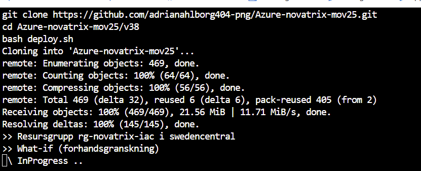

What-if visar i förväg exakt vad som kommer att hända: **5 resurser att skapa**, inga ändringar eller borttagningar. Först efter bekräftelse (`j`) deployas miljön.

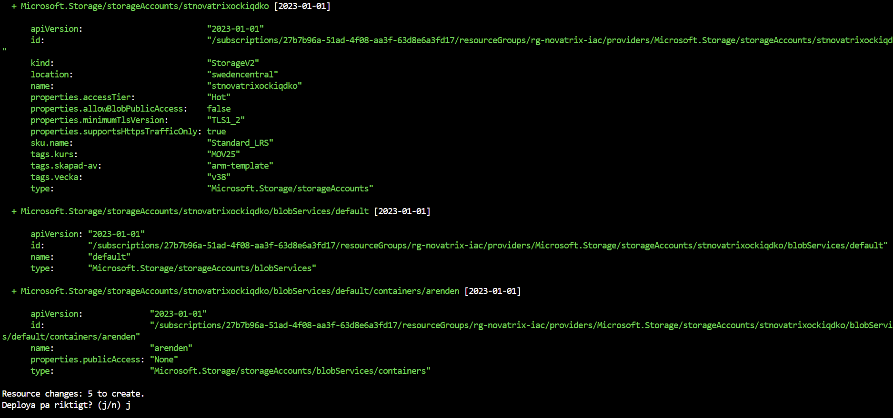

Deployen lyckades, och mallens outputs visar namnen på de skapade resurserna:

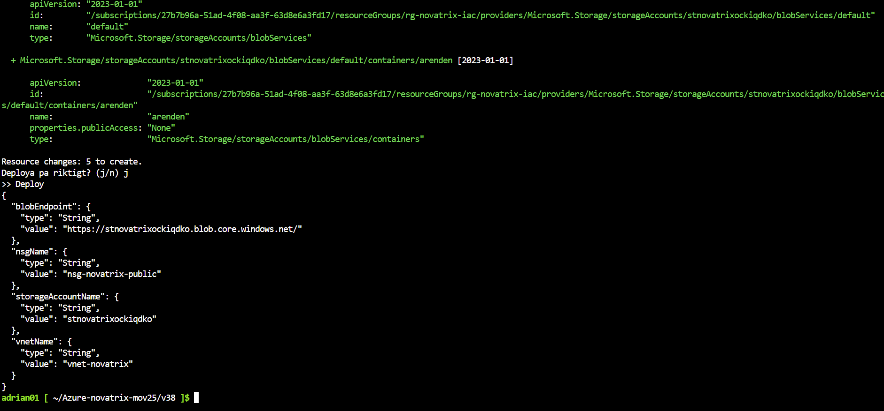

### Verifiering: lagringen är på plats

En testfil laddas upp till containern `arenden`, och sedan listas innehållet:

```bash
echo '{"test":"v38 IaC"}' > test-arende.json
az storage blob upload --account-name stnovatrixockiqdko -c arenden -f test-arende.json -n test/arende.json --auth-mode key
az storage blob list   --account-name stnovatrixockiqdko -c arenden --auth-mode key -o table
```

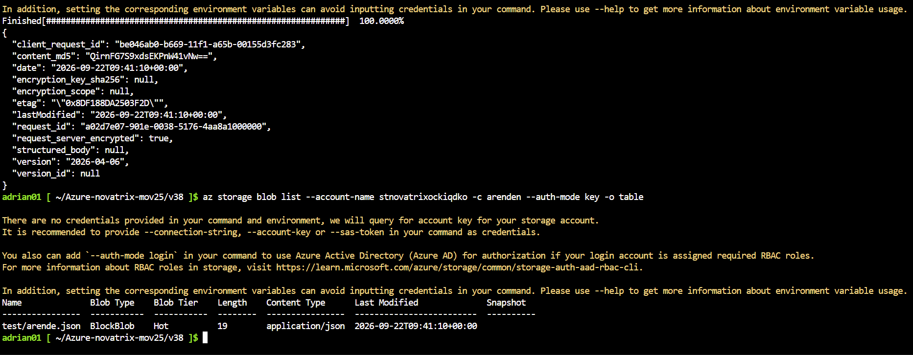

### Verifiering: nätverket

```bash
az network nsg rule list -g rg-novatrix-iac --nsg-name nsg-novatrix-public -o table
az network vnet subnet list -g rg-novatrix-iac --vnet-name vnet-novatrix \
  --query "[].{namn:name, prefix:addressPrefix, nsg:networkSecurityGroup.id}" -o table
```

Regeln `Allow-Web-Inbound` tillåter TCP 80 och 443 från Internet, och `snet-public` har NSG:n kopplad:

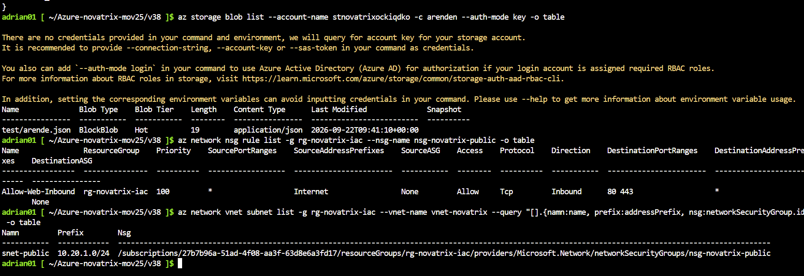

Hela NSG:n, inklusive Azures standardregler. Standardreglerna (prioritet 65000 och uppåt) blockerar all övrig inkommande trafik från Internet, så endast port 80 och 443 är öppna:

```bash
az network nsg rule list -g rg-novatrix-iac --nsg-name nsg-novatrix-public --include-default -o table
```

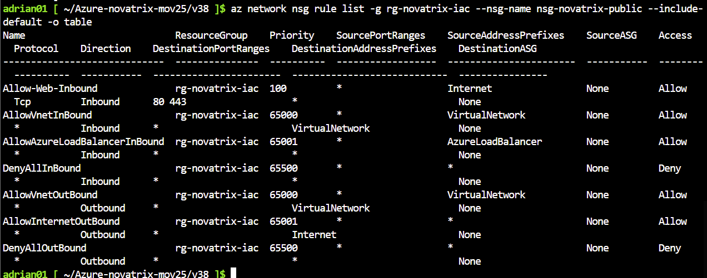

### Verifiering: formuläret är nåbart

Ärendeformuläret körs på VM:en från v34/v37 (`RG-novatrix`) och ingår inte i G-mallen. VM:en startas och formuläret nås via dess publika IP:

```bash
az vm start -g RG-novatrix -n VM-novatrix-web
az vm show -d -g RG-novatrix -n VM-novatrix-web --query publicIps -o tsv
```

Skärmbilden visar ett ärende som skickades in genom formuläret Den visar att formuläret och backend fungerar på den VM som mallen i ett senare steg ska ta över.

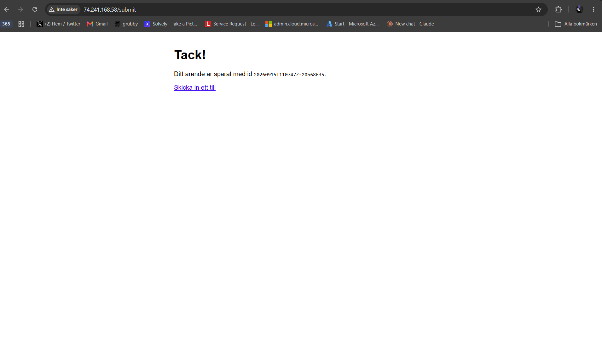

---

## Delmoment 4 – Versionshantering

### Ändringen

VNet:et utökades med ett **privat subnät**, `snet-private` (`10.20.2.0/24`), för att förbereda samma segmentering som i v36. Ändringen består av tre delar som hör ihop och därför committades som **en** logisk ändring:

**A – ny parameter:**

```json
"privateSubnetPrefix": {
  "type": "string",
  "defaultValue": "10.20.2.0/24",
  "metadata": { "description": "Adressrymd for det privata subnatet." }
}
```

**B – ny variabel:**

```json
"subnetPublicName": "snet-public",
"subnetPrivateName": "snet-private"
```

**C – nytt subnät i VNet:et:**

```json
{
  "name": "[variables('subnetPrivateName')]",
  "properties": {
    "addressPrefix": "[parameters('privateSubnetPrefix')]"
  }
}
```

Ändringen committades till `Master` med meddelandet `v38: privat subnät i VNet:et`.

### Förhandsgranskning och deploy av ändringen

```bash
cd ~/Azure-novatrix-mov25 && git pull && cd v38 && bash deploy.sh
```

What-if visar att **bara VNet:et får en verklig ändring**: `snet-private` läggs till. NSG:n och storage-kontot är oförändrade (`= Nochange`).

Raderna för `blobServices` och containern (orange, `-`) är känt brus i what-if. Azure fyller själv i standardvärden, som `deleteRetentionPolicy` och `defaultEncryptionScope`, som inte står i mallen, och what-if visar dem som om de skulle tas bort. I praktiken ändras ingenting där.

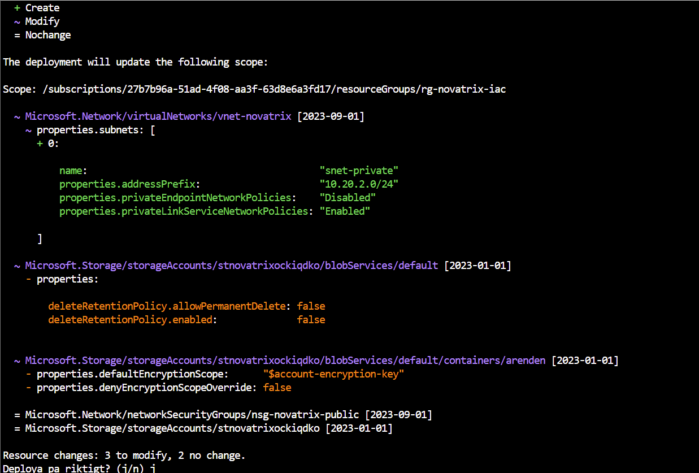

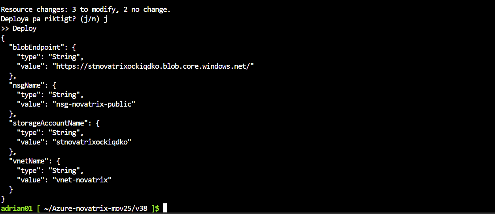

### Historik

```bash
git log --oneline -3 -- .
```

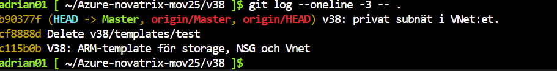

```bash
git show HEAD -- templates/azuredeploy.json
```

`git show` visar exakt vilka rader som lades till (`+`, grönt) och ändrades (`-`, rött), tillsammans med vem som gjorde ändringen, när, och varför:

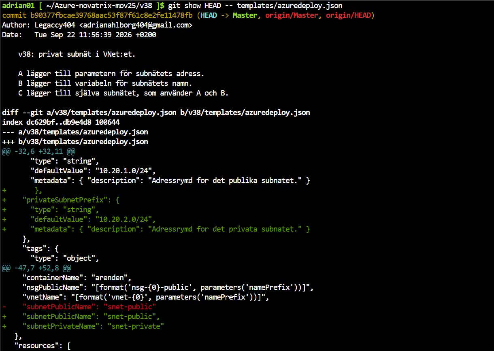

De första commitsen i v38-historiken visar när mappstrukturen sattes upp och en felaktig testfil togs bort. Historiken har lämnats orörd, eftersom spårbarheten är själva poängen med versionshantering.

### Hur versionshanteringen hjälper

**Drift**

- *Spårbarhet:* varje ändring i infrastrukturen har en commit som visar vem, vad, när och varför. Går något sönder syns direkt vilken ändring som gjordes senast.
- *Återställning:* en tidigare version av mallen kan hämtas med Git och deployas igen, så miljön går tillbaka till ett känt fungerande läge.
- *Förutsägbarhet:* what-if visar effekten av en ändring innan den genomförs, i stället för att man upptäcker den efteråt.
- *Samma resultat varje gång:* mallen ger identisk miljö oavsett vem som kör den, utan risk för missade klick.

**Samarbete**

- *En gemensam sanning:* repot visar hur miljön ska se ut. Ändringar i portalen syns inte för kollegor, men ändringar i repot gör det.
- *Granskning:* med branches och pull requests kan en kollega granska en ändring, och what-if-resultatet, innan den når `Master`.
- *Parallellt arbete:* flera personer kan arbeta på olika delar av mallen samtidigt, och Git hjälper till att slå ihop ändringarna.

---

## Delmoment 5 – Återskapa miljön

Hela den kodade delen av miljön kan återskapas från repot, utan några steg i portalen.

**Förutsättningar**

- Ett Azure-konto med minst rollen **Contributor** på prenumerationen.
- Tillgång till **Azure Cloud Shell** (Bash). Där finns `az` och `git` förinstallerade.

**Steg**

1. Öppna <https://shell.azure.com> och välj **Bash**.
2. Klona repot och kör deploy-skriptet:

   ```bash
   git clone https://github.com/adrianahlborg404-png/Azure-novatrix-mov25.git
   cd Azure-novatrix-mov25/v38
   bash deploy.sh
   ```

3. Granska what-if-resultatet och svara `j`.
4. Kontrollera resultatet med verifieringskommandona under [Delmoment 3](#delmoment-3--deploy-och-verifiering).

**Anpassa miljön** utan att ändra koden: ändra värdena i `templates/azuredeploy.parameters.json`, till exempel `namePrefix`, eller välj en annan resursgrupp och region:

```bash
RG=rg-novatrix-test LOCATION=westeurope bash deploy.sh
```

**Ta bort miljön:**

```bash
az group delete -n rg-novatrix-iac --yes --no-wait
```

**Viktigt om data:** mallen återskapar *infrastrukturen*, inte *innehållet*. Ärenden som sparats i containern följer inte med om miljön raderas och byggs om. I en riktig drift behövs därför backup av data, till exempel soft delete eller replikering, vid sidan av IaC.

---

## Begränsningar och reflektion

- **Det här är G-nivå:** mallen täcker lagring och nätverk. VM:en med Nginx och formuläret, samt managed identity och RBAC från v37, är fortfarande byggda för hand. Nästa steg vore att lägga till VM, publik IP, nätverkskort, identitet och rolltilldelning i samma mall, så att hela kundtjänsten kan återskapas med ett kommando.
- **Entra ID ingår inte:** användare och grupper från v35 hanteras av Microsoft Graph, inte av Azure Resource Manager, och kan därför inte skapas med ARM-templates.
- **Det viktigaste jag lärt mig:** skillnaden mellan att *göra* något i portalen och att *beskriva* det som kod. Koden blir dokumentation, historik och återställningsplan på samma gång. Med what-if kan jag dessutom se konsekvenserna innan jag ändrar något.
