# v39 – Automation och integration med Microsoft 365

**Kurs:** Microsoft Azure (MOV25) · **Uppgift:** 6 av 8 · **Företag:** Novatrix AB
**Tema:** Power Automate och integration mot Microsoft 365

När en kund skickar in ett ärende via Novatrix ärendeformulär ska det automatiskt registreras i Microsoft 365 och kundtjänst ska få en notis. Den här guiden visar hur kedjan byggdes steg för steg: från en JSON-blob i Azure Storage, via ett Power Automate-flöde, till en post i en SharePoint-lista och ett meddelande i Teams.

## Innehåll

1. [Översikt](#översikt)
2. [Miljö](#miljö)
3. [Steg 1 – Behörighet och nätverk](#steg-1--behörighet-och-nätverk)
4. [Steg 2 – Team och kanal i Teams](#steg-2--team-och-kanal-i-teams)
5. [Steg 3 – SharePoint-listan Ärenderegister](#steg-3--sharepoint-listan-ärenderegister)
6. [Steg 4 – Flödet i Power Automate](#steg-4--flödet-i-power-automate)
7. [Steg 5 – Verifiering](#steg-5--verifiering)
8. [Felsökning](#felsökning)
9. [Användbara felsökningskommandon](#användbara-felsökningskommandon)
10. [Resultat](#resultat)

---

## Översikt

```
Ärendeformulär (Nginx på VM)
  → JSON-blob sparas i containern arenden (lagringskonto stnovatrixmov25)
    → Power Automate: När en blob läggs till eller ändras (V2)
      → Hämta blobbinnehåll (V2)
        → Parsa JSON
          → SharePoint: Skapa objekt i listan Ärenderegister
          → Teams: meddelande i kanalen Kundtjänst / Ärenden
```

**Vad triggar flödet?** En ny blob i containern `arenden`. Formulärets backend sparar varje ärende som en JSON-fil där. Power Automate bevakar containern och startar en körning för varje ny blob.

**Vad gör flödet?** Läser blobbens innehåll, tolkar det som JSON, skapar en post i ärenderegistret med status *Ny* och skickar en notis till kundtjänstens Teams-kanal.

**Varför blob-trigger?** Formuläret behöver inte känna till Microsoft 365 – det skriver bara till lagringen, som redan var lösningens "sanning" sedan v37. Integrationen kan byggas ut utan att röra webbservern.

---

## Miljö

| Resurs | Namn |
|---|---|
| Resursgrupp | `RG-novatrix` |
| Lagringskonto | `stnovatrixmov25` |
| Container | `arenden` |
| VM (formulär) | `VM-Novatrix-Web-02-vecka-36-ny` |
| M365-konto | `azureuser@adrianahlborg404gmail.onmicrosoft.com` |
| Team / kanal | `Kundtjänst` / `Ärenden` |
| SharePoint-webbplats | `https://adrianahlborg404gmail.sharepoint.com/sites/Kundtjnst` |
| SharePoint-lista | `Ärenderegister` |
| Power Automate-miljö | `Standardkatalog (default)` |
| Flöde | `Novatrix – Nytt ärende till M365` |
| Anslutning (lagring) | `novatrix-storage` (Microsoft Entra ID Integrated) |

### Ärendeformat

Formuläret sparar varje ärende som en JSON-blob med fem fält:

```json
{"id": "20260915T110747Z-20b68635", "name": "test v1", "mail": "testv1@gmail.com", "message": "hej detta är ett test för vecka 37", "created": "20260915T110747Z"}
```

---

## Steg 1 – Behörighet och nätverk

### 1.1 Nätverk – släpp in Power Automate

Power Automate är en molntjänst utanför VNet:et och når lagringskontot över internet. Kontrollera att kontot inte är låst till enbart VNet:

```bash
az storage account show -n stnovatrixmov25 -g RG-novatrix \
  --query "networkRuleSet.defaultAction" -o tsv
```

Om svaret är `Deny`, öppna åtkomsten:

```bash
az storage account update -n stnovatrixmov25 -g RG-novatrix \
  --default-action Allow
```

### 1.2 RBAC – läsrätt för flödets konto

Flödet loggar in mot lagringen som `azureuser` via Microsoft Entra ID. Kontot får rollen **Storage Blob Data Reader** på lagringskontot – minsta behörighet som behövs för att läsa blobbar. Ingen åtkomstnyckel lagras i flödet.

```bash
az role assignment create \
  --assignee azureuser@adrianahlborg404gmail.onmicrosoft.com \
  --role "Storage Blob Data Reader" \
  --scope $(az storage account show -n stnovatrixmov25 -g RG-novatrix --query id -o tsv)
```

Kontroll:

```bash
az role assignment list \
  --assignee azureuser@adrianahlborg404gmail.onmicrosoft.com \
  --all -o table
```

```
Principal                                        Role                       Scope
-----------------------------------------------  -------------------------  ------------------------------------------------------------------
azureuser@adrianahlborg404gmail.onmicrosoft.com  Storage Blob Data Reader   /subscriptions/<subscription-id>/resourceGroups/RG-novatrix/
                                                                            providers/Microsoft.Storage/storageAccounts/stnovatrixmov25
```

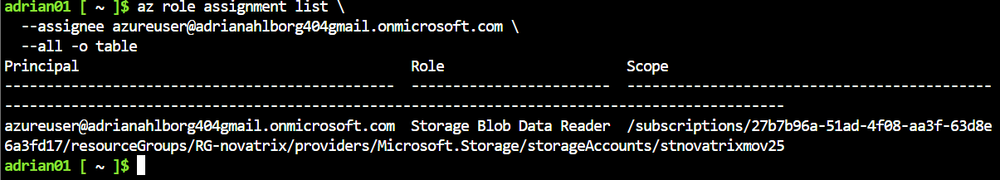
*Rolltilldelningen verifierad med Azure CLI.*

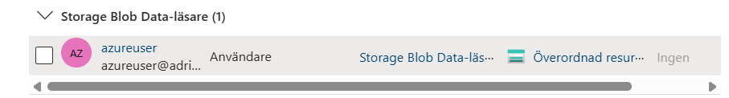
*Samma rolltilldelning i portalen under lagringskontots Åtkomstkontroll (IAM).*

---

## Steg 2 – Team och kanal i Teams

När ett team skapas i Teams skapas en SharePoint-webbplats automatiskt, kopplad till samma Microsoft 365-grupp. Teamet och ärenderegistret hänger därför ihop.

1. **Teams → + → Skapa team → Från början → Privat**, namn `Kundtjänst`.
2. **...** bredvid teamet → **Lägg till kanal** → `Ärenden`.

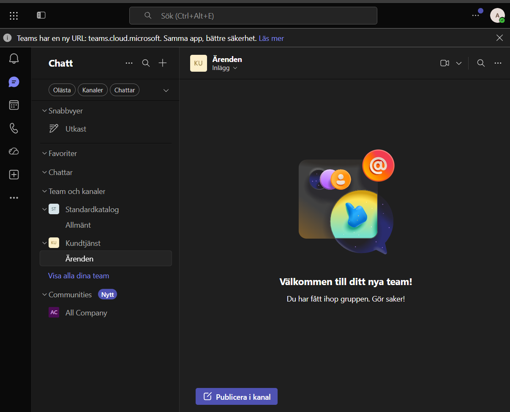
*Teamet Kundtjänst med kanalen Ärenden, dit flödet skickar notiser.*

---

## Steg 3 – SharePoint-listan Ärenderegister

Webbplatsen öppnas via kanalen **Ärenden → Delade → Öppna i SharePoint**. Listan skapas på webbplatsen via **kugghjulet → Webbplatsinnehåll → + Ny → Lista → Tom lista**.

> SharePoint tar bort å, ä och ö i adresser: webbplatsen *Kundtjänst* får adressen `/sites/Kundtjnst` och listan *Ärenderegister* `/Lists/renderegister`. Det påverkar inte funktionen. Kolumnnamnen skrevs utan å, ä och ö för att förenkla mappningen i Power Automate.

| Kolumn | Typ | Fylls med |
|---|---|---|
| Title (Rubrik) | Enkel textrad (finns redan) | `id` – fungerar som ärendenummer |
| Namn | Enkel textrad | `name` |
| Epost | Enkel textrad | `mail` |
| Kategori | Enkel textrad | tom – förberedd för utbyggnad |
| Beskrivning | Flera textrader | `message` |
| Status | Val: Ny, Pågår, Stängd | `Ny` |
| Blobnamn | Enkel textrad | blobbens namn – spårbarhet tillbaka till Azure |
| Inkommet | Datum och tid | blobbens `LastModified` |

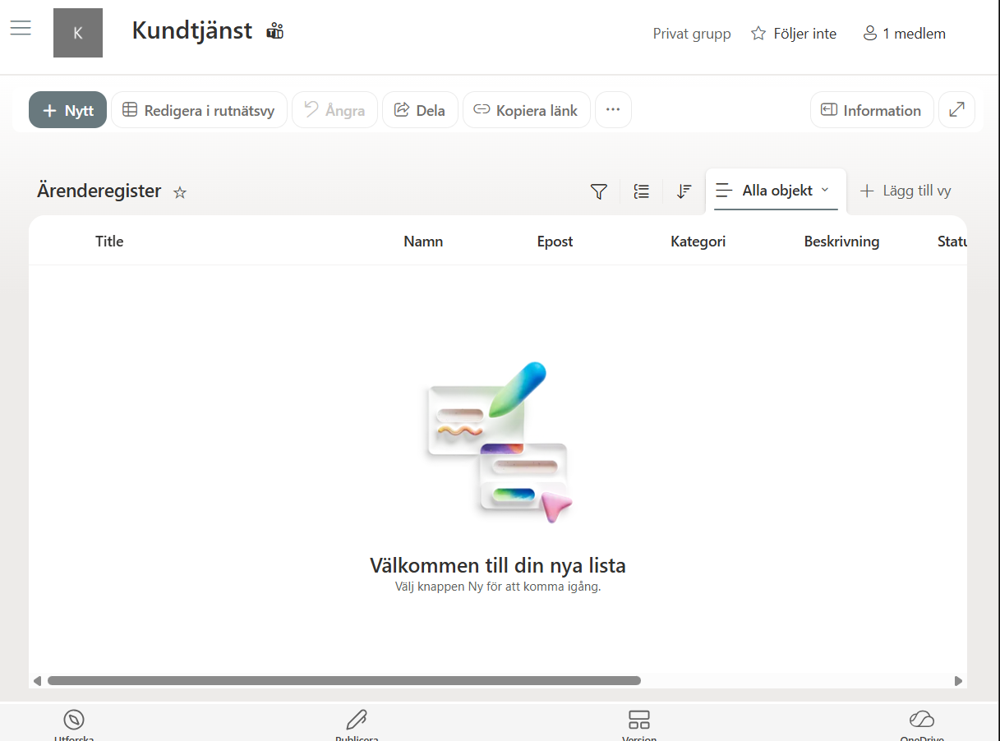
*Ärenderegistret innan första ärendet.*

---

## Steg 4 – Flödet i Power Automate

Flödet skapades på **make.powerautomate.com** som `azureuser`, i miljön **Standardkatalog**, som ett **Automatiserat molnflöde**. Azure Blob Storage-connectorn är en premiumconnector och kräver Power Automate Premium (trial räcker).

### 4.1 Trigger – När en blob läggs till eller ändras (enbart egenskaper) (V2)

Anslutning:

```
Anslutningsnamn:     novatrix-storage
Autentiseringstyp:   Microsoft Entra ID Integrated
```

Parametrar:

```
Lagringskontots namn eller blobslutpunkt:  stnovatrixmov25
Behållare:                                 /arenden
Antal blobbar att returnera:               10
```

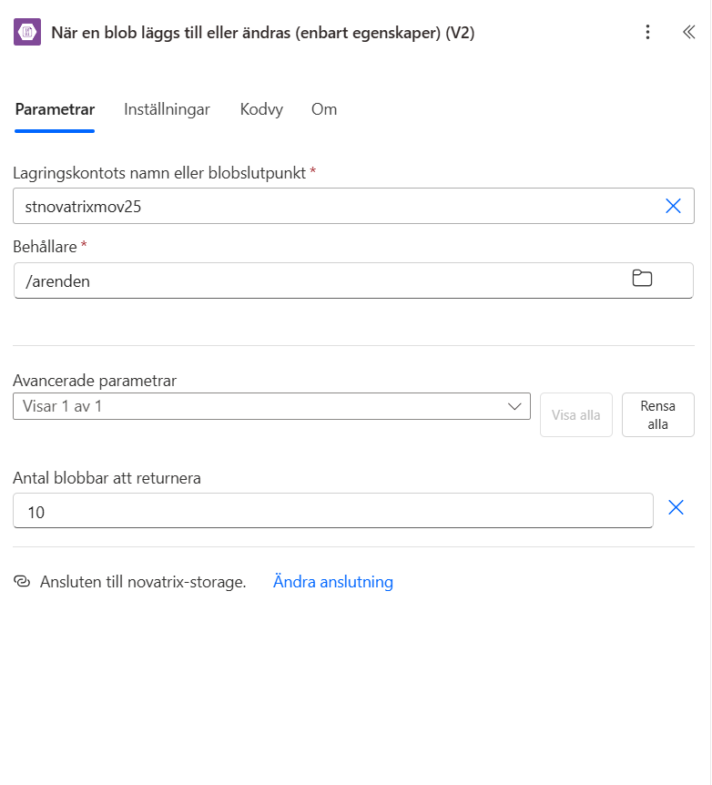
*Triggern bevakar containern arenden via anslutningen novatrix-storage.*

### 4.2 Hämta blobbinnehåll (V2)

```
Lagringskontots namn eller blobslutpunkt:  stnovatrixmov25
Blob:                                      body/Id   (från triggern)
Härled innehållstyp:                       Ja
```

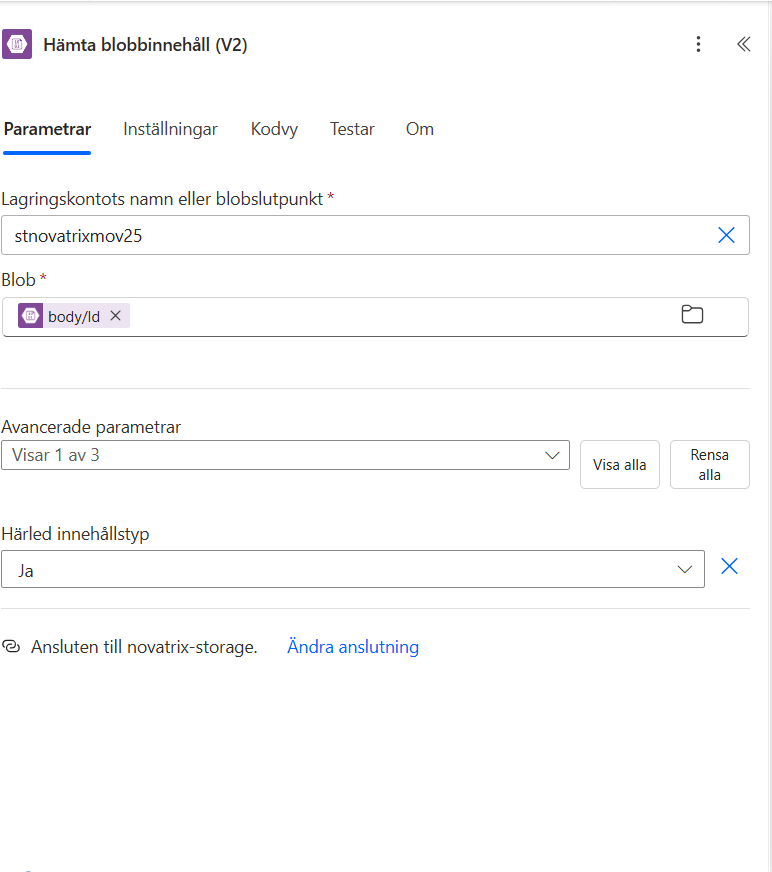
*Blobben hämtas med det Id som triggern returnerar.*

### 4.3 Parsa JSON

Blobbarna sparas med innehållstypen `application/octet-stream`, inte `application/json`. Innehållet kommer därför base64-kodat och måste avkodas innan det kan tolkas som JSON (se [Felsökning](#1-parsa-json-applicationoctet-stream)).

**Content** (uttryck):

```
json(base64ToString(body('Hämta_blobbinnehåll_(V2)')?['$content']))
```

**Schema** – genererat från ett exempelärende via *Använd en exempelnyttolast för att generera ett schema*:

```json
{
  "type": "object",
  "properties": {
    "id":      { "type": "string" },
    "name":    { "type": "string" },
    "mail":    { "type": "string" },
    "message": { "type": "string" },
    "created": { "type": "string" }
  }
}
```

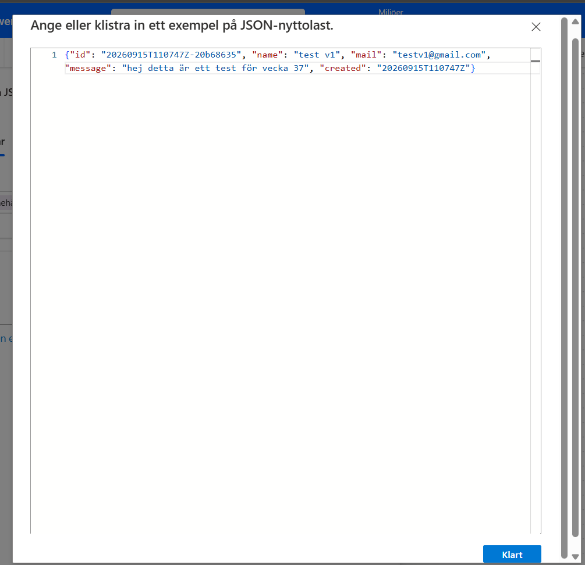
*Schemat genererades från ett riktigt ärende från formuläret.*

<!-- Lägg gärna till en skärmdump av Parsa JSON med uttrycket i Content-fältet här:

-->

### 4.4 Skapa objekt (SharePoint)

```
Webbplatsadress:  https://adrianahlborg404gmail.sharepoint.com/sites/Kundtjnst   (anpassat värde)
Listnamn:         Ärenderegister
```

| Kolumn | Värde | Källa |
|---|---|---|
| Rubrik | `Body id` | Parsa JSON |
| Namn | `Body name` | Parsa JSON |
| Epost | `Body mail` | Parsa JSON |
| Beskrivning | `Body message` | Parsa JSON |
| Status Value | `Ny` | fast värde |
| Blobnamn | `body/Name` | trigger |
| Inkommet | `body/LastModified` | trigger |

Fältet `created` används inte i Inkommet eftersom formatet `20260915T110747Z` inte godtas som datum av SharePoint. Blobbens `LastModified` är redan i rätt format och motsvarar när ärendet sparades.

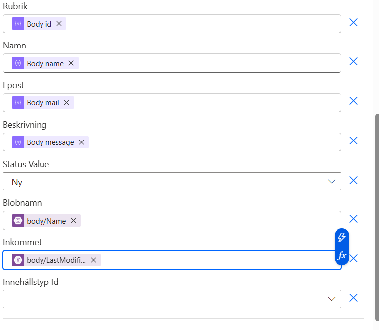
*Fälten från ärendet mappas till kolumnerna i Ärenderegister.*

### 4.5 Publicera meddelande i en chatt eller en kanal (Teams)

```
Publicera som:   Flödesrobot
Publicera i:     Kanal
Team:            Kundtjänst
Kanal:           Ärenden
```

Meddelande:

```
Nytt ärende har kommit in.
Ärende-ID: [Body id]
Från: [Body name] ([Body mail])
Meddelande: [Body message]
Ärendet är registrerat i SharePoint-listan Ärenderegister.
```

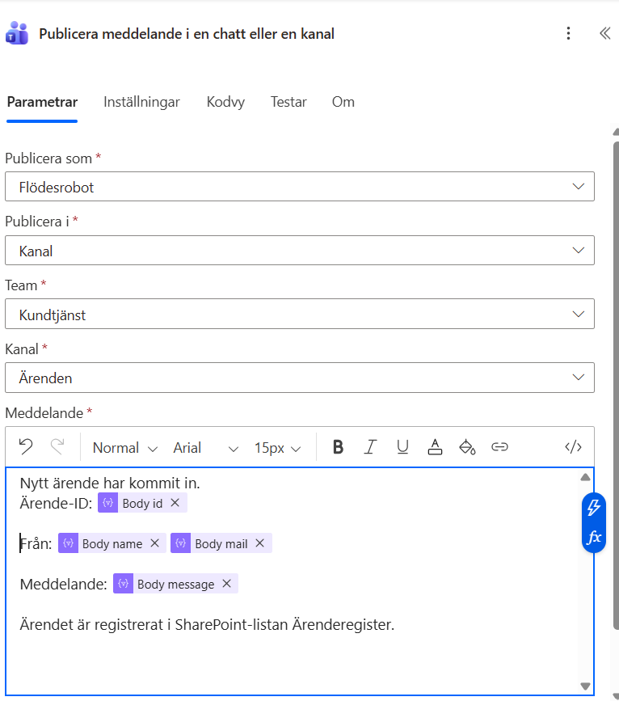
*Notisen byggs med fälten från ärendet.*

### 4.6 Hela flödet

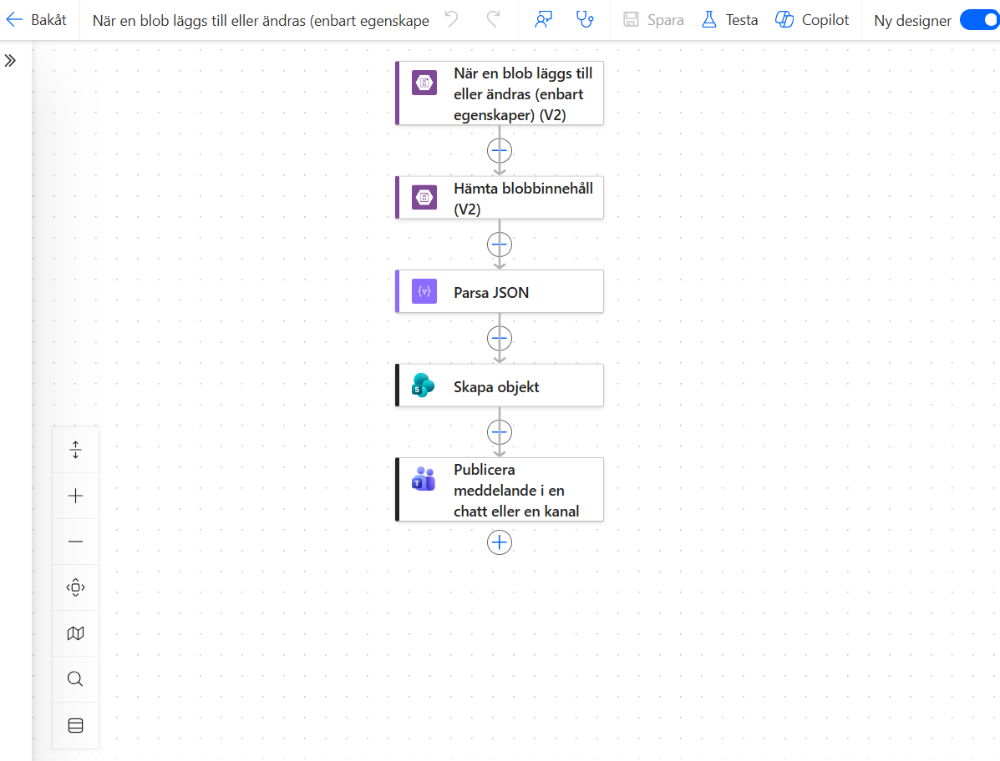
*Flödets fem steg: trigger, hämta innehåll, tolka JSON, registrera i SharePoint, notifiera i Teams.*

---

## Steg 5 – Verifiering

### 5.1 Testmetod

VM:en med formuläret startades. Formulärets inskickat och backend skapar JSON. Flödet triggas av blobben, så hela kedjan från lagring till Microsoft 365 testades och funkade.


### 5.2 Kedjan steg för steg

**1. Blobben hamnar i containern**

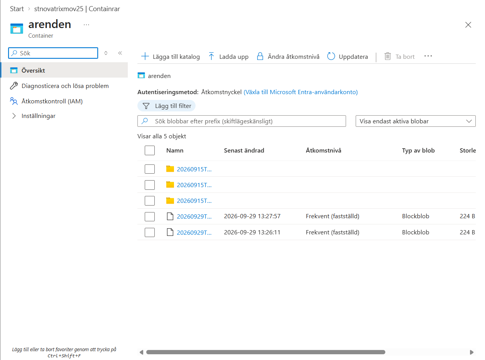
*Testärendena (20260929T…) ligger bredvid tidigare ärenden från formuläret (20260915T…).*

**2. Flödet körs utan fel**

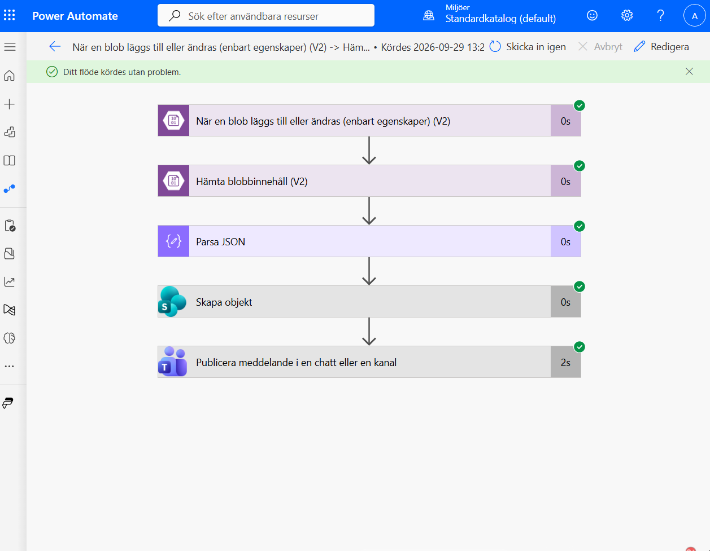
*Alla fem steg gröna i körningshistoriken.*

**3. Ärendet registreras i SharePoint**

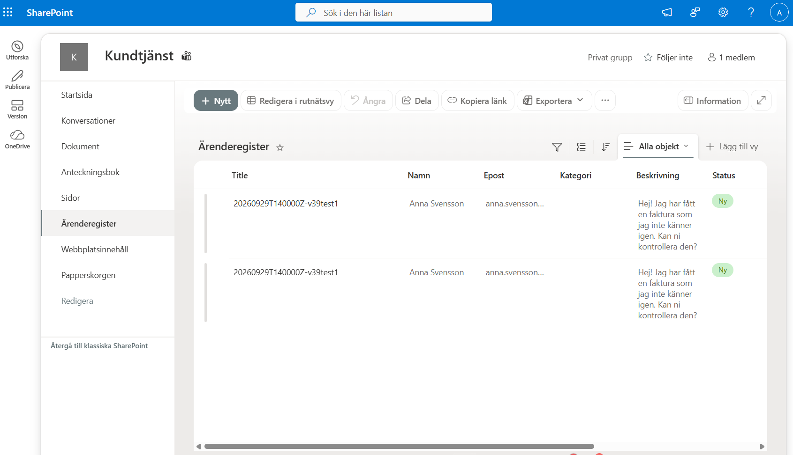
*Posterna från testkörningarna i Ärenderegister, med ärende-id som rubrik och status Ny.*

**4. Kundtjänst får en notis i Teams**

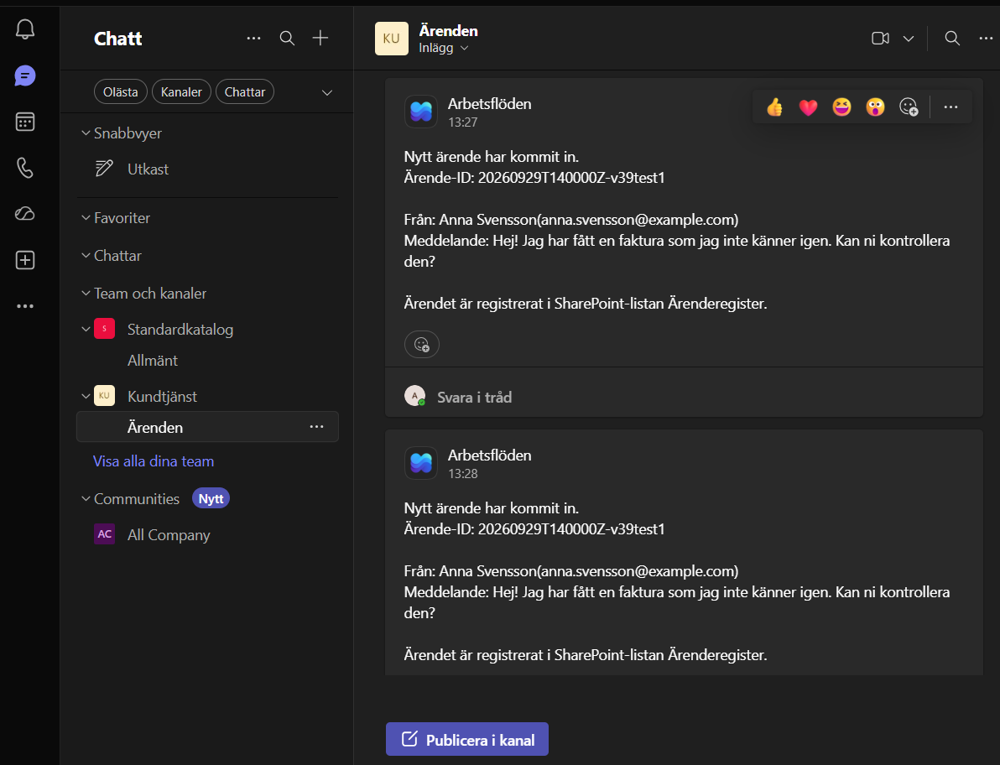
*Flödesroboten publicerar ärendet i kanalen Ärenden.*

---

## Felsökning

### 1. Parsa JSON: application/octet-stream

Första körningen misslyckades i steget Parsa JSON:

```
The property 'content' must be of type JSON in the 'ParseJson' action inputs,
but was of type 'application/octet-stream'.
```

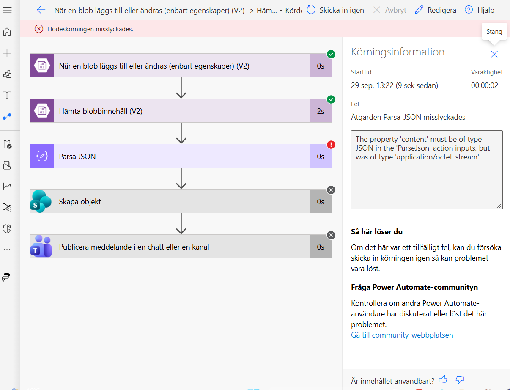
*Triggern och Hämta blobbinnehåll lyckades – nätverk, RBAC och anslutning fungerade. Felet låg i hur innehållet tolkades.*

**Orsak:** blobbarna sparas med innehållstypen `application/octet-stream`. Power Automate levererar då innehållet som base64 i fältet `$content` i stället för som JSON.

**Lösning:** avkoda innehållet med ett uttryck i Parsa JSON:

```
json(base64ToString(body('Hämta_blobbinnehåll_(V2)')?['$content']))
```

Namnet i `body('...')` är stegets namn med mellanslag ersatta av understreck. Kontrollera det exakta namnet under **Kodvy** i Hämta blobbinnehåll-steget.

Kontrollera en blobs innehållstyp:

```bash
az storage blob show \
  --account-name stnovatrixmov25 \
  --container-name arenden \
  --name <blobnamn> \
  --auth-mode login \
  --query properties.contentSettings.contentType -o tsv
```

En alternativ lösning vore att låta formulärets backend spara blobbarna med `application/json`. Uttrycket valdes eftersom det gör flödet robust oavsett hur blobben sparas.


## Användbara felsökningskommandon

### Inloggning och prenumeration

```bash
# Vilket konto och vilken prenumeration används?
az account show -o table

# Logga in igen om Cloud Shell tappat token
az logout
az login --use-device-code
```

### Lagring och nätverk

```bash
# Tillåter lagringskontot åtkomst utifrån? (Allow / Deny)
az storage account show -n stnovatrixmov25 -g RG-novatrix \
  --query "networkRuleSet.defaultAction" -o tsv

# Lista blobbar i containern
az storage blob list \
  --account-name stnovatrixmov25 \
  --container-name arenden \
  --auth-mode login -o table

# Ladda ned en blob och läs innehållet
az storage blob download \
  --account-name stnovatrixmov25 \
  --container-name arenden \
  --name <blobnamn> \
  --file arende.json \
  --auth-mode login
cat arende.json

# Innehållstyp för en blob
az storage blob show \
  --account-name stnovatrixmov25 \
  --container-name arenden \
  --name <blobnamn> \
  --auth-mode login \
  --query properties.contentSettings.contentType -o tsv
```

> `--auth-mode login` kräver att det inloggade kontot har en dataroll (t.ex. Storage Blob Data Reader/Contributor). Får du behörighetsfel, använd `--auth-mode key` eller ge kontot rollen.

### Behörigheter (RBAC)

```bash
# Vilka roller har azureuser?
az role assignment list \
  --assignee azureuser@adrianahlborg404gmail.onmicrosoft.com \
  --all -o table

# Vilka roller finns på lagringskontot?
az role assignment list \
  --scope $(az storage account show -n stnovatrixmov25 -g RG-novatrix --query id -o tsv) \
  -o table
```


---

## Resultat

| Krav för G | Uppfyllt |
|---|---|
| Fungerande flöde som integrerar Microsoft 365 med kundtjänsten | Ja – Power Automate-flödet i steg 4 |
| Inskickat ärende hamnar i ärenderegistret | Ja – post i Ärenderegister (bild 13) |
| Ärendet genererar en notis | Ja – meddelande i Teams-kanalen Ärenden (bild 14) |
| Kedjan verifierad | Ja – blob → körning → SharePoint → Teams (bild 11–14) |
| Dokumenterat i repot | Ja – denna README |

Flödet är robust mot hur blobben sparas (base64-avkodning), använder Entra ID i stället för åtkomstnycklar och minsta nödvändiga behörighet (Storage Blob Data Reader).
