# v40 – Virtualiseringsnivåer: VM, containers och serverless

**Kurs:** Microsoft Azure (MOV25) · **Uppgift:** 7 av 8 · **Företag:** Novatrix AB
**Tema:** VM, containers och serverless

Novatrix kundtjänst har hittills körts på en virtuell maskin. Den här veckan körs en del av kundtjänsten på en annan virtualiseringsnivå: mottagningen av ett ärende är byggd som en **Azure Function** (serverless). Funktionen tar emot formulärets fält och sparar ärendet som en JSON-blob i containern `arenden`, samma ställe som Flask-backenden på VM:en har skrivit till sedan v37. Därefter jämförs de tre nivåerna, VM, containers och serverless, utifrån just ärendemottagningen.

## Innehåll

1. [Översikt](#översikt)
2. [Miljö](#miljö)
3. [Steg 1 – Förkontroller](#steg-1--förkontroller)
4. [Steg 2 – Function App](#steg-2--function-app)
5. [Steg 3 – Hanterad identitet och behörighet](#steg-3--hanterad-identitet-och-behörighet)
6. [Steg 4 – Miljövariabler](#steg-4--miljövariabler)
7. [Steg 5 – Koden och publicering](#steg-5--koden-och-publicering)
8. [Steg 6 – Verifiering](#steg-6--verifiering)
9. [Jämförelse: VM, containers och serverless](#jämförelse-vm-containers-och-serverless)
10. [Lärdomar](#lärdomar)
11. [Filer i mappen](#filer-i-mappen)

---

## Översikt

```text
Webbläsare / curl
   │  POST /api/arende  (name, mail, message)
   ▼
Azure Function  func-Novatrix-arende-aa   (Flex-förbrukning, Python 3.12)
   │  token via systemtilldelad hanterad identitet (ingen nyckel)
   ▼
Lagringskonto stnovatrixmov25  →  container arenden
   └── <id>/arende.json
```

**Varför serverless för just ärendemottagningen?** Hanteraren är liten, den gör en enda sak och körs bara när en kund skickar in ett ärende. Det är en typisk händelsestyrd uppgift: det finns ingen anledning att ha en server igång dygnet runt för att vänta på några ärenden om dagen.

**Vad ändras i resten av lösningen?** Ingenting. Funktionen skriver ärendet i samma format och till samma container som VM:ens backend. Allt som läser från containern, till exempel Power Automate-flödet från v39, ser bara en ny blob och behöver inte veta vilken nivå som tog emot ärendet. Fältet `kalla` visar ändå var ärendet kom in.

---

## Miljö

| Resurs | Namn / värde |
|---|---|
| Resursgrupp | `RG-novatrix` |
| Lagringskonto / container | `stnovatrixmov25` / `arenden` |
| Function App | `func-Novatrix-arende-aa` |
| Adress | `https://func-novatrix-arende-aa-bqenhqezfze2h8gf.swedencentral-01.azurewebsites.net` |
| Hostingplan | Flex-förbrukning (Flex Consumption), Linux |
| Runtime | Python 3.12 |
| Region | Sweden Central |
| Funktion / endpoint | `arende_mottagning` / `POST /api/arende` |
| Identitet | Systemtilldelad hanterad identitet |
| Roll | Storage Blob Data Contributor på containern `arenden` |
| Taggar | `Projekt = novatrix`, `vecka = vecka40` |

---

## Steg 1 – Förkontroller

Funktionen ligger utanför Novatrix VNet och når lagringskontot över internet, så kontot måste tillåta publik åtkomst. Det öppnades redan i v39. Innan något byggdes kontrollerades nätverksinställningen och att Azure Functions Core Tools finns i Cloud Shell:

```bash
az account show --query "{prenumeration:name}" -o table

az storage account show -n stnovatrixmov25 -g RG-novatrix \
  --query "{publik:publicNetworkAccess, standard:networkRuleSet.defaultAction}" -o table

func --version
```

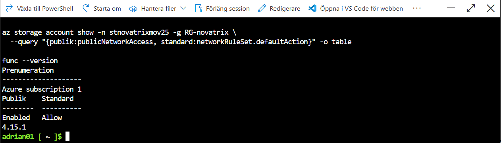
*Bild 1: Publik åtkomst `Enabled`, standardåtgärd `Allow`, Core Tools 4.15.1.*

---

## Steg 2 – Function App

Function Appen skapades i portalen: **Funktionsapp → + Skapa → Flex-förbrukning**.

| Inställning | Värde |
|---|---|
| Resursgrupp | `RG-novatrix` |
| Namn | `func-Novatrix-arende-aa` |
| Säkert unikt standardnamn på värddator | Aktiverad |
| Körningsstack / version | Python 3.12 |
| Region | Sweden Central |
| Instansstorlek | 2048 MB |
| Lagring | Nytt eget driftkonto (`rgnovatrixaa62`), inte `stnovatrixmov25` |
| Application Insights | Aktiverad |
| Kontinuerlig distribution | Inaktiverad (publicering från Cloud Shell) |

**Varför Flex-förbrukning?** Planen skalar ner till noll när inga ärenden kommer in och debiteras per körning. Det är själva poängen med serverless för en funktion som används sporadiskt.

**Säkert unikt standardnamn** ger adressen en slumpad ändelse och regionen i namnet. Det gör det svårare att gissa sig till appens adress.

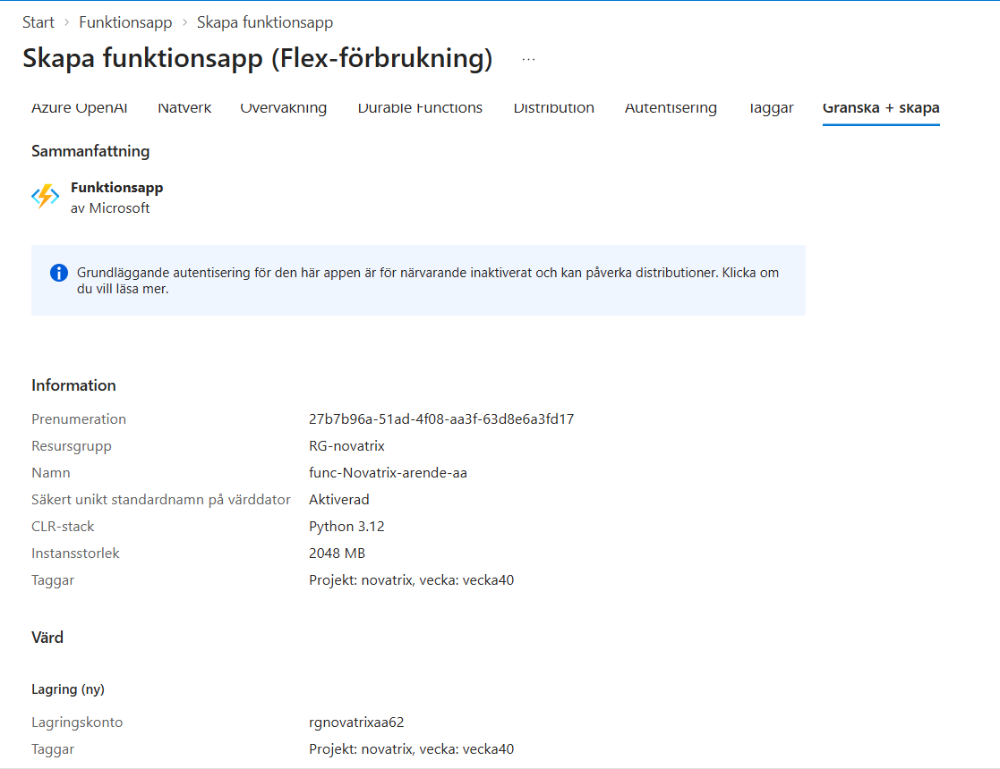
*Bild 2: Sammanfattningen innan appen skapades.*

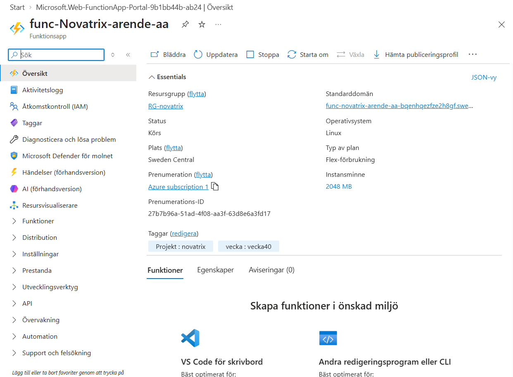
*Bild 3: Function Appen är skapad och har status Körs.*

---

## Steg 3 – Hanterad identitet och behörighet

Funktionen loggar in mot lagringen med en egen identitet i Microsoft Entra ID. Ingen nyckel eller anslutningssträng finns i koden. Det är samma princip som VM:en följer sedan v37.

**Identitet:** Function App → **Inställningar → Identitet → Systemtilldelat → Status På → Spara**.

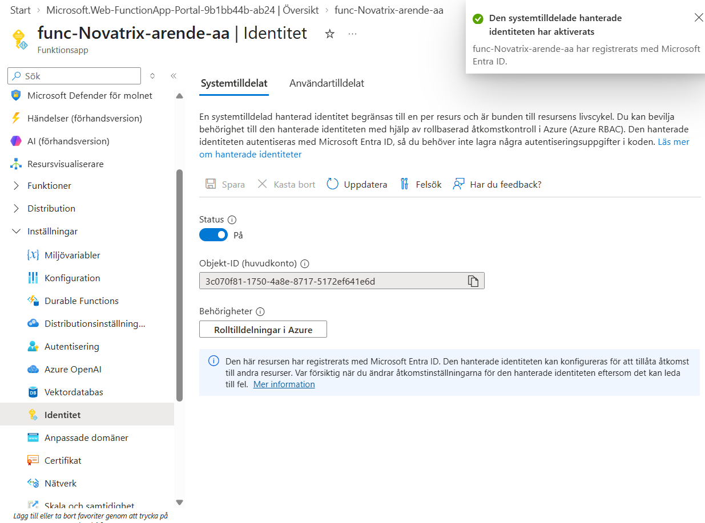
*Bild 4: Den systemtilldelade identiteten är aktiverad och registrerad i Entra ID.*

**Roll:** `stnovatrixmov25` → **Containrar → arenden → Åtkomstkontroll (IAM) → Lägg till rolltilldelning**. Rollen **Storage Blob Data Contributor** (Storage Blob Data-deltagare) tilldelades den hanterade identiteten för `func-Novatrix-arende-aa`.

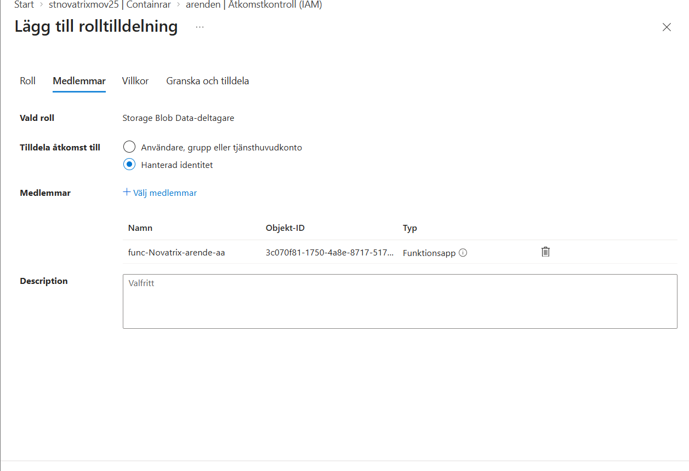
*Bild 5: Rollen tilldelas på containern `arenden`, inte på hela kontot.*

Kontroll i Cloud Shell:

```bash
PRINCIPAL=$(az functionapp identity show -n func-novatrix-arende-aa -g RG-novatrix \
  --query principalId -o tsv)

az role assignment list --assignee $PRINCIPAL --all \
  --query "[].{roll:roleDefinitionName, scope:scope}" -o table
```

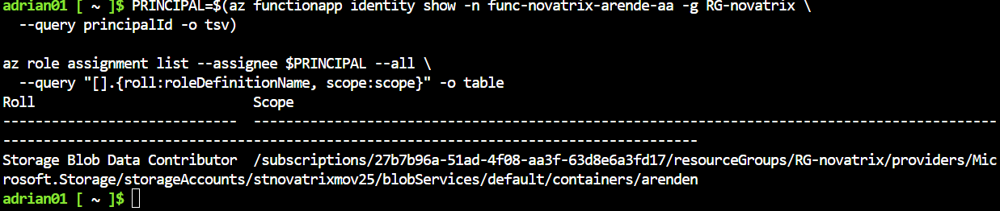
*Bild 6: Scopet slutar på `/containers/arenden`.*

**Minsta behörighet:** Contributor behövs eftersom funktionen ska *skriva* blobbar, Reader räcker inte. Rollen ligger på containern och inte på lagringskontot, så funktionen kommer inte åt någon annan data i kontot.

---

## Steg 4 – Miljövariabler

Koden läser lagringskontots adress och containerns namn från appinställningar, så att inget är hårdkodat. Adressen är ingen hemlighet. Åtkomsten styrs av identiteten och rollen.

```bash
az functionapp config appsettings set -n func-novatrix-arende-aa -g RG-novatrix \
  --settings STORAGE_ACCOUNT_URL=https://stnovatrixmov25.blob.core.windows.net \
             ARENDE_CONTAINER=arenden
```

| Namn | Värde |
|---|---|
| `STORAGE_ACCOUNT_URL` | `https://stnovatrixmov25.blob.core.windows.net` |
| `ARENDE_CONTAINER` | `arenden` |

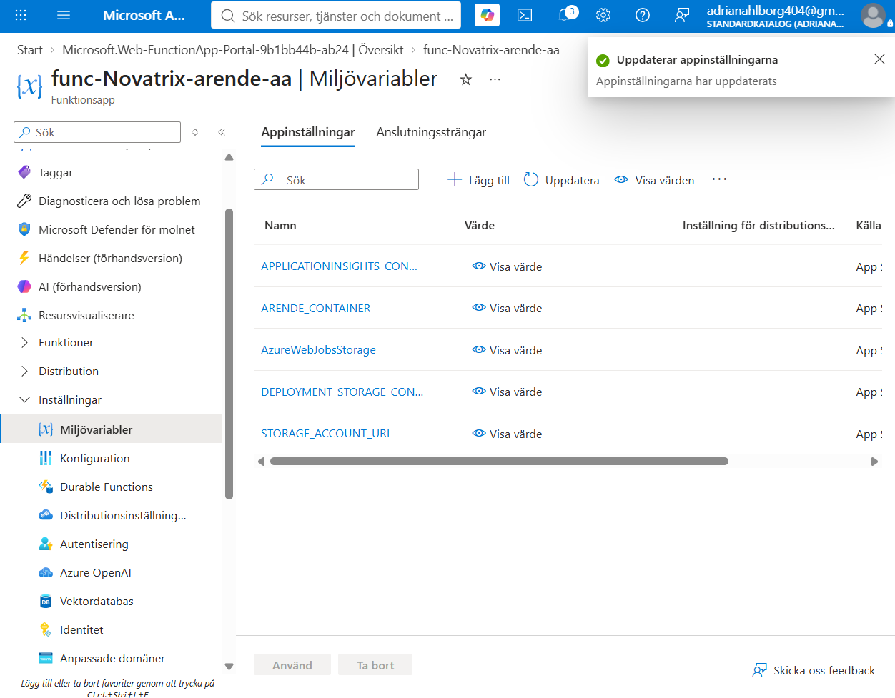
*Bild 7: `ARENDE_CONTAINER` och `STORAGE_ACCOUNT_URL` bland appinställningarna.*

---

## Steg 5 – Koden och publicering

Projektet skapades i Cloud Shell med Azure Functions Core Tools och Pythons programmeringsmodell v2:

```bash
mkdir -p ~/novatrix-func && cd ~/novatrix-func
func init . --python
```

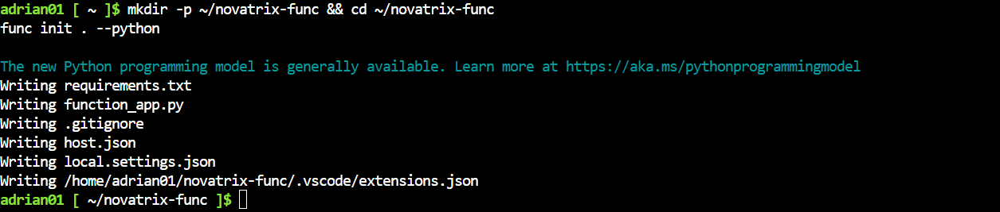
*Bild 8: Projektet skapat.*

### requirements.txt

```text
azure-functions
azure-identity
azure-storage-blob
```

### function_app.py

```python
import json
import logging
import os
import uuid
from datetime import datetime, timezone
from html import escape

import azure.functions as func
from azure.identity import DefaultAzureCredential
from azure.storage.blob import BlobServiceClient, ContentSettings

app = func.FunctionApp(http_auth_level=func.AuthLevel.ANONYMOUS)

_blob_service = None


def blob_service():
    """Skapar klienten första gången och återanvänder den sedan.
    DefaultAzureCredential hämtar token via appens hanterade identitet."""
    global _blob_service
    if _blob_service is None:
        _blob_service = BlobServiceClient(
            account_url=os.environ["STORAGE_ACCOUNT_URL"],
            credential=DefaultAzureCredential(),
        )
    return _blob_service


def las_falt(req):
    """Läser fälten från ett vanligt formulär eller från JSON."""
    if req.form:
        return {k: req.form.get(k, "").strip() for k in ("name", "mail", "message")}
    try:
        data = req.get_json()
    except ValueError:
        data = {}
    return {k: str(data.get(k, "")).strip() for k in ("name", "mail", "message")}


@app.route(route="arende", methods=["POST"])
def arende_mottagning(req: func.HttpRequest) -> func.HttpResponse:
    falt = las_falt(req)
    if not all(falt.values()):
        return func.HttpResponse("Fälten name, mail och message krävs.", status_code=400)

    nu = datetime.now(timezone.utc).strftime("%Y%m%dT%H%M%SZ")
    arende_id = f"{nu}-{uuid.uuid4().hex[:8]}"
    arende = {"id": arende_id, **falt, "created": nu, "kalla": "azure-function"}

    container = os.environ.get("ARENDE_CONTAINER", "arenden")
    blob = blob_service().get_blob_client(container, f"{arende_id}/arende.json")
    blob.upload_blob(
        json.dumps(arende, ensure_ascii=False),
        content_settings=ContentSettings(content_type="application/json"),
    )
    logging.info("Ärende %s sparat i %s", arende_id, container)

    if req.form:
        html = (f"<h1>Tack {escape(falt['name'])}!</h1>"
                f"<p>Ditt ärende har registrerats med id {arende_id}.</p>")
        return func.HttpResponse(html, mimetype="text/html", status_code=200)

    return func.HttpResponse(
        json.dumps({"status": "mottaget", "id": arende_id}),
        mimetype="application/json",
        status_code=201,
    )
```

**Hur koden fungerar:**

- `@app.route` gör funktionen till en HTTP-trigger på `/api/arende` som bara tar emot `POST`.
- `las_falt` klarar både ett vanligt webbformulär och JSON, så samma endpoint fungerar för webbläsare och för andra system.
- Saknas något fält svarar funktionen `400` och sparar ingenting.
- Ärendet får ett id av tidsstämpel och slumpdel, i samma format som VM:ens backend, och sparas som `<id>/arende.json`.
- `DefaultAzureCredential` hämtar en token via den hanterade identiteten. Klienten skapas första gången den behövs och återanvänds sedan av samma instans.
- Formulär får en tack-sida i HTML (`200`), JSON-anrop får ett JSON-svar (`201 Created`).

**Varför anonym åtkomst (`AuthLevel.ANONYMOUS`)?** Det är ett publikt kontaktformulär, precis som sidan på VM:en. En funktionsnyckel skulle ändå behöva ligga i formulärets HTML och skulle därför inte skydda någonting. Det funktionen kan göra är att skriva nya ärenden i en enda container.

### Publicering

```bash
func azure functionapp publish func-novatrix-arende-aa --python
```

Beroendena byggs i Azure (fjärrbygge), och sist listas funktionen med sin adress:

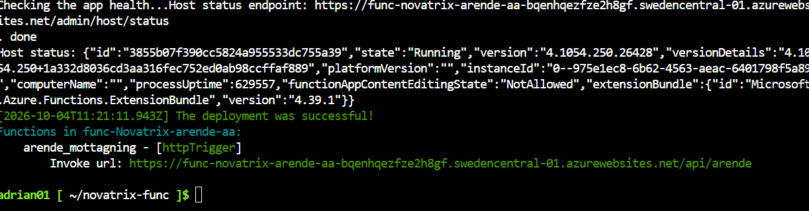
*Bild 9: Distributionen lyckades och `arende_mottagning` är registrerad som HTTP-trigger.*

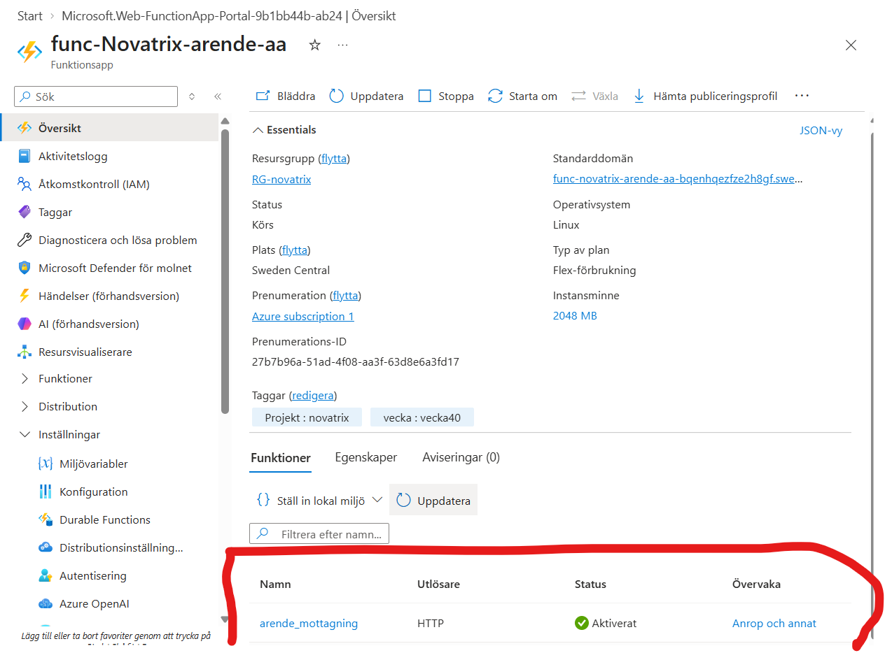
*Bild 10: Funktionen syns i portalen med status Aktiverat.*

---

## Steg 6 – Verifiering

### 6.1 Anrop med curl

```bash
URL="https://func-novatrix-arende-aa-bqenhqezfze2h8gf.swedencentral-01.azurewebsites.net/api/arende"

# JSON
curl -i -X POST "$URL" -H "Content-Type: application/json" \
  -d '{"name":"Test v40","mail":"testv40@example.com","message":"Ärende via Azure Function"}'

# Formulär, som en webbläsare skickar
curl -i -X POST "$URL" \
  --data-urlencode "name=Formulärtest" \
  --data-urlencode "mail=form@example.com" \
  --data-urlencode "message=Skickat som formulär"

# Felfall, fält saknas
curl -i -X POST "$URL" -H "Content-Type: application/json" -d '{"name":"Bara namn"}'
```

| Test | Svar | Betydelse |
|---|---|---|
| JSON | `201 Created` | Ärendet sparades |
| Formulär | `200 OK` + tack-sida | Fungerar som ett webbformulär |
| Fält saknas | `400 Bad Request` | Valideringen stoppar ofullständiga ärenden |

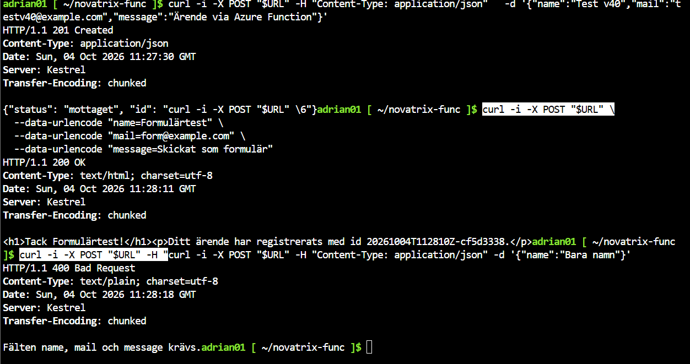
*Bild 11: De tre anropen och svaren.*

### 6.2 Svarstider och kallstart

```bash
for i in 1 2 3; do
  curl -s -o /dev/null -X POST "$URL" -H "Content-Type: application/json" \
    -d '{"name":"Tidtest","mail":"tid@example.com","message":"Mäter svarstid"}' \
    -w "Anrop $i: DNS %{time_namelookup}  anslutning %{time_connect}  TLS %{time_appconnect}  första byte %{time_starttransfer}  totalt %{time_total}\n"
done
```

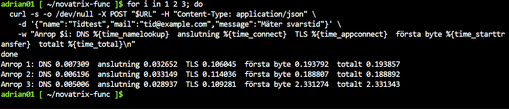
*Bild 12: Svarstiden uppdelad på nätverk och funktion.*

| Anrop | Nätverk (fram till TLS) | Funktionen (TLS → första byte) | Totalt |
|---|---|---|---|
| 1 | 0,11 s | 0,09 s | 0,19 s |
| 2 | 0,11 s | 0,07 s | 0,19 s |
| 3 | 0,11 s | 2,22 s | 2,33 s |

Nätverket står för cirka 0,1 s i varje anrop. En varm instans svarar på under 0,1 s. Anrop 3 väntade drygt 2 s på funktionssidan medan nätverket var lika snabbt som annars, troligen för att plattformen skickade anropet till en ny instans som först fick starta Python och läsa in biblioteken (kallstart). En tidigare mätning gav cirka 2,6 s på två anrop i rad, vilket stämmer med samma förklaring.

### 6.3 I webbläsaren

En enkel testsida (`src/test-formular.html`) skickar formuläret direkt till funktionen med `method="post"`.

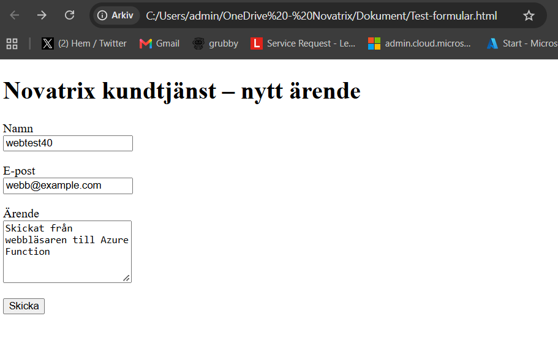
*Bild 13: Ifyllt formulär, öppnat som lokal fil.*

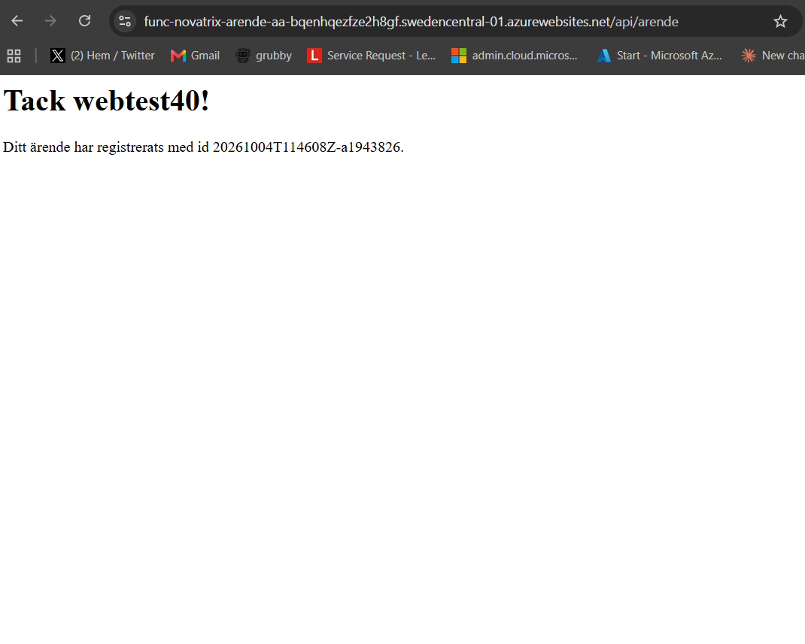
*Bild 14: Svaret kommer från funktionens adress (`…azurewebsites.net/api/arende`) med ärendets id.*

### 6.4 Ett ärende hela vägen

Formulärtestet från 6.1 fick id `20261004T112810Z-cf5d3338`. Samma id går att följa genom hela kedjan:

| Var | Vad som syns |
|---|---|
| curl (bild 11) | `200 OK` och tack-svaret med id `…cf5d3338` |
| Containern (bild 15) | Filen `20261004T112810Z-cf5d3338/arende.json` |
| Funktionens logg (bild 16) | Token via hanterad identitet, `PUT` mot `arenden`, `201` från lagringen och *Ärende … sparat i arenden* |

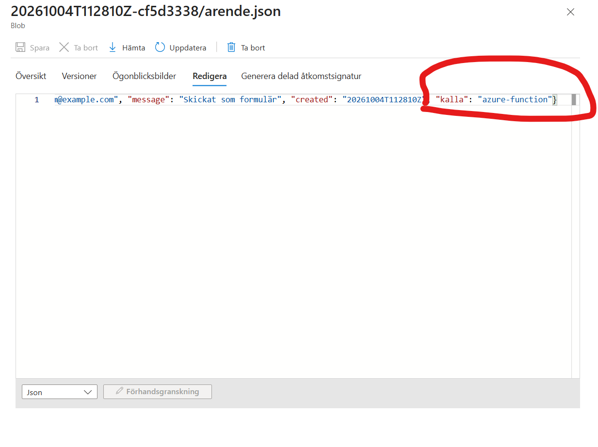
*Bild 15: `arende.json` i containern `arenden`, med `"kalla": "azure-function"`.*

Filens fullständiga innehåll:

```json
{"id": "20261004T112810Z-cf5d3338", "name": "Formulärtest", "mail": "form@example.com", "message": "Skickat som formulär", "created": "20261004T112810Z", "kalla": "azure-function"}
```

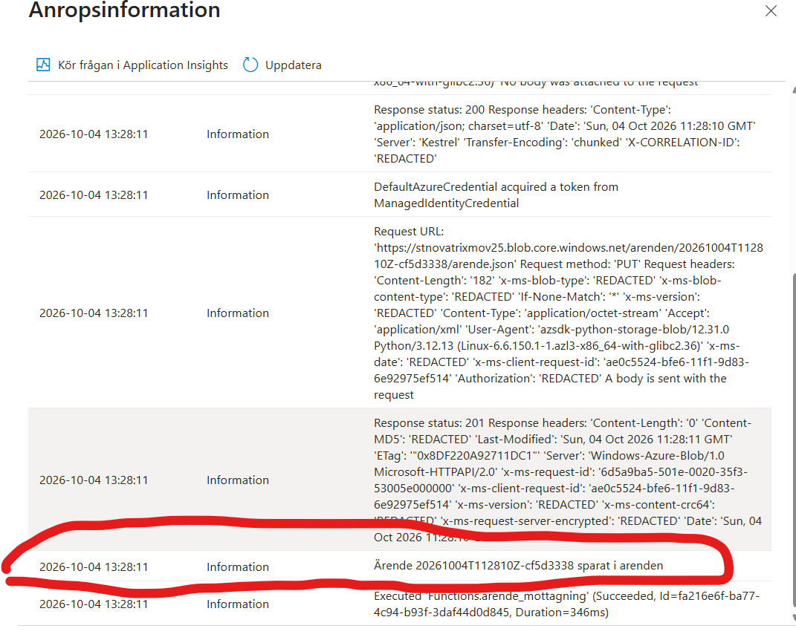
*Bild 16: Anropsinformation. `DefaultAzureCredential acquired a token from ManagedIdentityCredential` visar att ingen nyckel användes. Körningen lyckades på 346 ms.*

---

## Jämförelse: VM, containers och serverless

Kärnan i jämförelsen: ju högre upp man går, desto mer sköter Azure och desto mindre kontroll har man själv.

### Hur nivåerna fungerar

**VM (virtuell maskin).** En hypervisor delar upp en fysisk server i flera virtuella datorer. Varje VM har eget operativsystem och egen kärna och beter sig som en vanlig server. Man ansvarar själv för allt från operativsystemet och uppåt: uppdateringar, säkerhet, runtime och applikation. Novatrix webbserver sedan v34 är en VM med Ubuntu, Nginx, Flask och systemd, allt installerat och konfigurerat för hand.

**Container.** Applikationen paketeras tillsammans med sina beroenden i en image. Containern körs isolerad men delar värdmaskinens operativsystemkärna, så den är mycket lättare än en VM, startar på sekunder och beter sig likadant överallt. I Azure kan en container köras i Container Instances (en enskild container) eller Container Apps (med automatisk skalning, även ner till noll). Man sköter imagen, Azure sköter servern.

**Serverless (Azure Functions).** Man lämnar bara kod. Plattformen startar instanser när en händelse kommer in, här ett HTTP-anrop, skalar ut vid många samtidiga anrop och stänger ner när det är tyst. Man betalar per körning i stället för per timme och ser aldrig någon server.

### Skillnader

| | VM | Container | Serverless |
|---|---|---|---|
| Vad man sköter själv | OS, patchar, runtime, app | Image (runtime + app) | Bara koden |
| Isolering | Eget OS och egen kärna | Delad kärna, isolerad process | Hanteras av plattformen |
| Starttid | Minuter | Sekunder | Sekunder vid kallstart, sedan millisekunder |
| Skalning | Manuell eller skalningsuppsättning | Regler, Container Apps kan gå till noll | Automatisk per händelse, ner till noll |
| Kostnadsmodell | Per timme så länge den är igång | Per sekund för CPU och minne | Per körning och minnestid |
| Kontroll | Full | Hög inom imagen | Låg, plattformens ramar |
| Typisk Novatrix-del | Webbservern med Nginx (v34–v39) | Hela kundtjänstappen som paket | Ärendemottagningen (v40) |

### För- och nackdelar för ärendemottagningen

**På VM:en**

- Fördel: formulär och backend ligger på samma server, och man har full kontroll över allt.
- Nackdel: maskinen kostar dygnet runt fast ärenden kommer sällan. Operativsystemet måste patchas, och en VM kräver ledig kapacitet och kvot i regionen för att alls kunna starta. Skalning vid många ärenden måste lösas manuellt.

**Som container**

- Fördel: Flask-backenden kan flyttas nästan som den är, och samma image går att köra lokalt och i Azure.
- Nackdel: det krävs ett containerregister, och basimagen måste hållas uppdaterad. Det är mycket runtomkring för en hanterare som bara tar emot ett formulär.

**Serverless**

- Fördel: koden är 67 rader och ingen server behöver underhållas. Funktionen körs bara när ett ärende kommer in, skalar själv om många kommer samtidigt, och kostnaden vid Novatrix volymer är i praktiken noll.
- Nackdel: kallstart. Mätningen visade drygt 2 s extra när en ny instans startade, jämfört med under 0,1 s för en varm instans. Funktionen är också tillståndslös och bunden till Azures programmeringsmodell.

### Slutsats

För ärendemottagningen passar serverless bäst. Uppgiften är liten, händelsestyrd och sporadisk, och en fördröjning på ett par sekunder spelar ingen roll när en kund skickar in ett formulär. VM:en är fortfarande rätt för det som måste vara igång hela tiden eller kräver full kontroll över miljön. Containers är mellanvägen när en hel applikation ska flyttas till molnet utan att skrivas om. För ett system som kräver jämn och låg svarstid hade kallstarten varit en nackdel, och där hade en VM eller en container som alltid är igång passat bättre.

---

## Lärdomar

- **Säkert unikt standardnamn ändrar adressen.** Adressen fick en slumpad ändelse och regionen i namnet, och `az functionapp show --query defaultHostName` gav ett tomt svar. Den rätta adressen hämtades i stället från publiceringsutskriften (Invoke url).
- **Variabler i Cloud Shell lever bara i sessionen.** När `$URL` var tom fick curl en tom adress. Med `echo $URL` före testerna går det fort att se om variabeln finns.
- **Rollen på containern i stället för kontot.** Det går att begränsa en roll till en enda container, och det var allt funktionen behövde.
- **Loggen visar hela kedjan.** I anropsinformationen syns både att token kom från den hanterade identiteten och vilken blob som skrevs. Det gör felsökning och verifiering mycket enklare än på VM:en.
- **Mät innan du drar slutsatser.** Den första tidsmätningen tydde på att allt var långsamt. Uppdelad på DNS, anslutning, TLS och första byte visade den att nätverket var snabbt och att fördröjningen kom från instansstarter.

---

## Filer i mappen

| Fil | Innehåll |
|---|---|
| `src/function_app.py` | Funktionen |
| `src/requirements.txt` | Python-beroenden |
| `src/host.json` | Värdkonfiguration från `func init` |
| `src/test-formular.html` | Testsida som skickar till funktionen |
| `bilder/` | Skärmbilder 01–16 |
